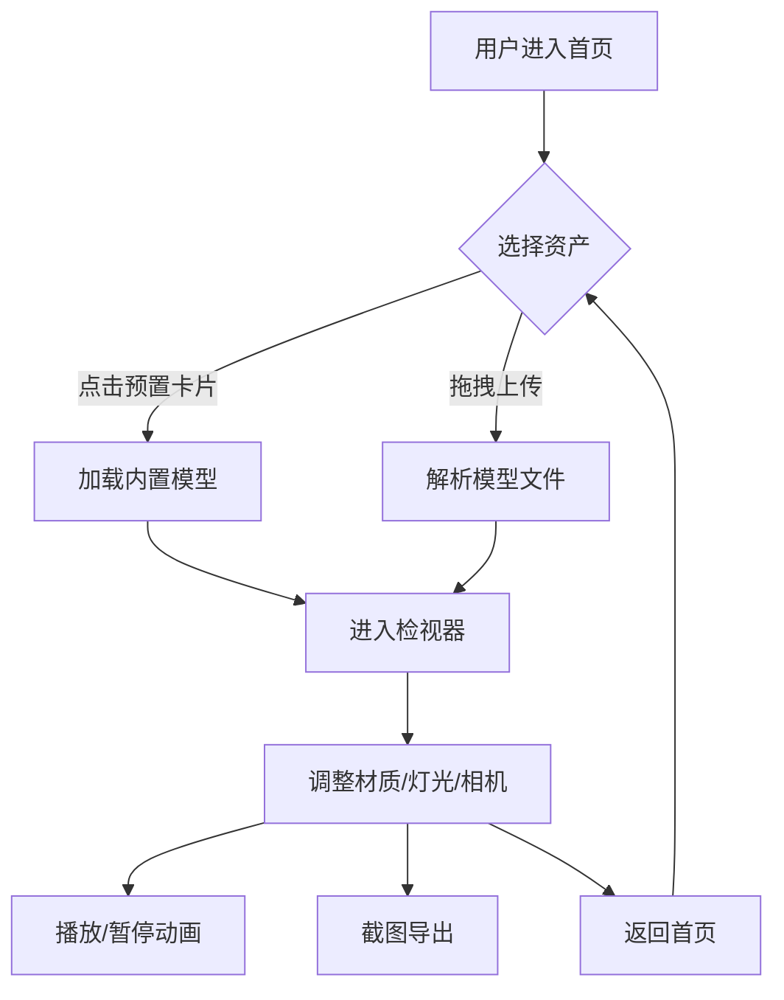

# VREEN — 3D 游戏类显示系统 PRD

## 1. 产品概述

VREEN 是一款面向独立游戏开发者、3D 艺术家与游戏爱好者的高端 3D 资产检视与展示平台。系统以"全息操控台"为视觉隐喻，将 GLB/GLTF/OBJ/FBX/STL/PLY 等主流 3D 格式的导入、检视、材质编辑、动画播放、灯光与相机控制、环境切换与高质量渲染整合在单一桌面端 Web 应用中，并以类似游戏引擎 Inspector 的面板化 HUD 提供专业级交互体验。

- **核心价值**：在浏览器内即可完成"上传—检视—调参—出图"全链路工作流，无需安装任何本地软件。
- **目标用户**：独立游戏开发者、3D 美术、TA（技术美术）、模型审稿者、玩家社区运营。
- **差异化定位**：相比通用模型查看器（如 model-viewer），VREEN 强调"游戏引擎级 Inspector 体验 + 全息 HUD 美学 + 多格式兼容"三位一体。

## 2. 核心功能

### 2.1 用户角色
本系统为单用户工具类应用，无需多角色与登录体系。

### 2.2 功能模块
1. **首页（Gallery / 资产库）**：示例模型卡片网格 + 自定义资产快速上传入口 + 启动"检视器"按钮。
2. **检视器（Viewer）**：3D 主舞台 + 左侧对象树（Outliner） + 右侧 Inspector 面板 + 顶部时间轴与播放控制 + 底部状态栏。
3. **环境与后处理设置（Environment Studio）**：HDRI 环境切换、曝光、Tone Mapping、Bloom/DOF/SSAO/Chromatic Aberration 等开关。
4. **材质编辑（Material Lab）**：Base Color、Metalness、Roughness、Emissive、Normal/Opacity 强度实时调节。
5. **截图与导出（Capture）**：高分辨率 PNG 截图下载（带背景与透明背景两套预设）。

### 2.3 页面详情
| 页面名称 | 模块名称 | 功能描述 |
|---------|---------|---------|
| 首页 | 顶部 HUD 栏 | 站点 Logo "VREEN"、系统状态指示灯、版本号与时间显示 |
| 首页 | Hero 区 | 大标题 "VREEN // 3D Display System"、副标题、CTA 按钮"Launch Inspector" |
| 首页 | 资产库卡片网格 | 至少 6 张预置模型卡（机器人、机甲、低多边形树、宝石、太空船、动物）含标签与缩略图预览 |
| 首页 | 上传面板 | 拖拽 / 点击上传区域，支持多格式（GLB/GLTF/OBJ/FBX/STL/PLY），并显示格式解析状态 |
| 首页 | 底部系统日志 | 终端风滚动日志："// SYSTEM READY"、"// ASSET INDEX LOADED" 等 |
| 检视器 | 顶部工具栏 | 资产名称、播放/暂停、速度选择、相机预设（前/后/顶/侧/自由）、截图按钮、返回首页 |
| 检视器 | 左侧 Outliner | 场景对象层级树，支持点击选中与隔离显示 |
| 检视器 | 中央 3D 舞台 | 实时 PBR 渲染，含地面阴影、轨道相机、模型自动居中、动画播放 |
| 检视器 | 右侧 Inspector | Transform（位置/旋转/缩放）、Material 实时编辑、灯光参数、环境预设 |
| 检视器 | 底部状态栏 | FPS、三角面数、DrawCall、动画时间、当前相机信息 |

## 3. 核心流程

### 3.1 用户旅程
1. 用户访问首页 → 看到全息风 Hero 区与资产库 → 点击"Launch Inspector"或某张资产卡。
2. 检视器加载预置模型（首次）或用户上传的本地模型（GLB/GLTF/OBJ/FBX/STL/PLY）。
3. 用户通过 Inspector 调整 Transform、材质、灯光与环境；通过时间轴播放动画。
4. 用户使用相机预设切换视角，按下截图按钮导出 PNG。
5. 用户可随时返回首页切换或上传新模型。

### 3.2 流程图

## 4. 用户界面设计

### 4.1 设计风格
- **设计隐喻**：游戏引擎 Inspector + 太空舱全息操控台。
- **主色调**：深空黑 `#05070d` 为主底；霓虹青 `#00f0ff` 与品红 `#ff2bd6` 双辅色；琥珀 `#ffb648` 作为警告/活动指示。
- **辅助色**：烟玻璃白 `#e8f4ff` 文字主色，灰雾 `#5a6478` 次级文字。
- **字体方案**：展示字体 `Orbitron`（科幻显示），等宽 `JetBrains Mono`（系统日志与数值），中文后备 `Noto Sans SC`。
- **按钮风格**：六边形/切角矩形描边按钮，hover 时内填充 12% 主色并产生 0 0 24px 主色辉光。
- **布局风格**：模块化 HUD 卡片，1px 描边 + 1px 内描边形成"双线"科技感，背景为深色径向渐变叠加扫描线纹理。
- **图标风格**：1.5px 描边线性图标，描边色随 hover 变化为主色。
- **动效**：页面进入 staggered fade-up（80ms 间隔），按钮 hover 0.2s 颜色与辉光过渡，相机切换 0.8s ease-in-out 缓动，HUD 卡片边框周期性 6s "扫描光"动画。

### 4.2 页面设计概述
| 页面名称 | 模块名称 | UI 元素 |
|---------|---------|---------|
| 首页 | 顶部 HUD | 固定高 56px，左侧 VREEN Logo + 状态灯，中间路径条 `home / index`，右侧 UTC 时钟 |
| 首页 | Hero | 全屏 100vh，巨字 "VREEN // 3D DISPLAY SYSTEM"，副标题，居中 CTA 按钮，背景 3D 粒子流 |
| 首页 | 资产卡片 | 6 列网格，卡片含 16:9 缩略图（实时 3D 预览）、名称、标签、hover 卡片抬升 + 边框辉光 |
| 首页 | 上传区 | 60vh 区域，巨型虚线六边形 + 中央 "DROP MODEL HERE" + 格式标签 |
| 检视器 | 顶部工具栏 | 高度 56px，胶囊按钮组：相机预设、播放控制、截图、退出 |
| 检视器 | Outliner | 宽 260px，深色面板，等宽字体显示节点名与三角面数 |
| 检视器 | 3D 舞台 | 自适应中部区域，含坐标网格地面、阴影、OrbitControls |
| 检视器 | Inspector | 宽 320px，分组折叠面板：Transform、Material、Lighting、Environment、Post-FX |
| 检视器 | 状态栏 | 高度 32px，等宽字体显示 FPS / Tris / DrawCalls / Time |

### 4.3 响应式
- **桌面优先**：主目标分辨率 1440×900 及以上，最低支持 1280×720。
- **平板**：≥1024 时侧边栏可折叠为图标条。
- **移动端**：<1024 时仅展示首页静态介绍与"请在桌面端使用"提示，检视器不可用。
- **触控**：所有按钮命中区域 ≥44px，滑动条支持拖动。

### 4.4 3D 场景指导
- **环境 / HDRI**：内置 4 套 HDRI（Studio / Sunset / Warehouse / Night City），通过 drei `<Environment preset />` 切换。
- **灯光配置**：1 颗主方向光（带阴影 mapSize 2048）+ 1 颗环境补光 + IBL 环境贴图。
- **相机配置**：PerspectiveCamera fov 35，初始位置 `(4, 3, 5)`，目标原点；OrbitControls 启用 damping 0.08，距离限制 2–20。
- **构图与焦点**：模型自动包围盒居中 + 缩放归一化至直径 2 单位；地面半透明圆盘 + ContactShadows。
- **交互与动画**：拖拽旋转、滚轮缩放、右键平移；内置 6 个预置模型均带 Idle 动画（部分），时间轴支持 scrub。
- **后期处理**：Bloom（intensity 0.6, threshold 0.85）、ChromaticAberration（offset 0.0008）、Vignette（darkness 0.45），并提供开关。
- **资产来源**：全部预置模型来自开源仓库 Khronos `glTF-Sample-Models` 与 Poly Haven 衍生样例；性能预算单模型 ≤100k 三角面。
