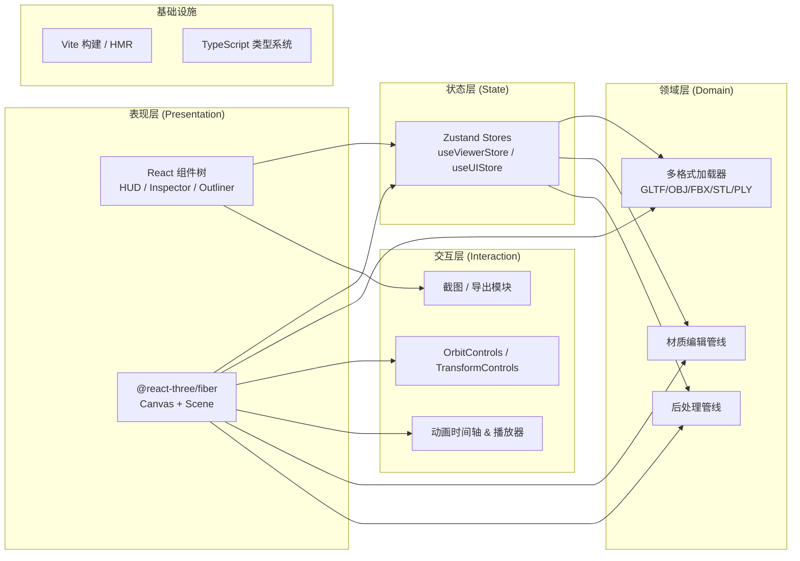

# VREEN 技术架构

## 1. 架构设计

VREEN 是一个纯前端单页应用（SPA），所有 3D 资源与逻辑均在浏览器端运行；不依赖后端服务与数据库，模型文件由用户本地拖拽或点击上传，无服务端存储。



## 2. 技术栈

- **构建工具**：Vite 5（初始化：`npm create vite@latest . -- --template react-ts`）
- **前端框架**：React 18 + TypeScript 5
- **样式方案**：TailwindCSS 3 + CSS 变量（自定义 HUD 主题）
- **3D 引擎**：
  - `three` 0.160+
  - `@react-three/fiber` 8.x
  - `@react-three/drei` 9.x（Environment、OrbitControls、useGLTF、ContactShadows、Html）
  - `@react-three/postprocessing` 2.x（Bloom、ChromaticAberration、Vignette、EffectComposer）
  - `postprocessing` 6.x
- **3D 加载器**：
  - `three/examples/jsm/loaders/GLTFLoader`
  - `three/examples/jsm/loaders/OBJLoader`
  - `three/examples/jsm/loaders/FBXLoader`
  - `three/examples/jsm/loaders/STLLoader`
  - `three/examples/jsm/loaders/PLYLoader`
- **状态管理**：Zustand 4.x
- **动效**：Framer Motion 11（仅用于 HUD 面板过渡）
- **图标**：`lucide-react`
- **字体**：Google Fonts（Orbitron、JetBrains Mono、Noto Sans SC）
- **后端**：无（纯前端 SPA）
- **数据库**：无

## 3. 路由定义

使用 `react-router-dom` v6 的 hash 路由，便于静态部署与本地预览。

| 路由 | 用途 |
|------|------|
| `/` | 首页（Gallery + Hero + Upload） |
| `/viewer/:assetId?` | 检视器；可选 assetId 指向预置模型；无则读取上传的本地模型 |

## 4. 核心模块设计

### 4.1 多格式加载器 `loaders/formatLoader.ts`
统一接口 `loadModel(file: File | string, format: ModelFormat): Promise<THREE.Object3D>`，内部按扩展名分发到对应 Loader；加载完成后执行：
1. 包围盒计算 → 居中 + 归一化缩放
2. 阴影启用 `castShadow / receiveShadow`
3. 材质引用收集（供 Inspector 编辑）

### 4.2 Zustand Store 划分
- `useViewerStore`：当前 scene root、动画 clips、播放状态、相机预设
- `useInspectorStore`：选中对象、Transform、Material 实时参数
- `useUIStore`：环境 HDRI、后处理开关、主题 HUD 强调色

### 4.3 截图模块
使用 `gl.domElement.toDataURL('image/png')` + 临时 `preserveDrawingBuffer: true` 渲染；提供 1x / 2x 倍率下载。

## 5. 数据模型

本应用不持久化用户数据到数据库。仅在内存中持有：

```ts
type ModelFormat = 'glb' | 'gltf' | 'obj' | 'fbx' | 'stl' | 'ply';

interface SceneNode {
  id: string;
  name: string;
  type: 'Group' | 'Mesh' | 'Bone' | 'Light';
  visible: boolean;
  triCount: number;
  materialId?: string;
  transform: { position: [number, number, number]; rotation: [number, number, number]; scale: [number, number, number] };
}

interface MaterialState {
  id: string;
  baseColor: string;       // hex
  metalness: number;       // 0..1
  roughness: number;       // 0..1
  emissive: string;
  emissiveIntensity: number;
  normalScale: number;
  opacity: number;         // 0..1
  wireframe: boolean;
}

interface EnvironmentState {
  preset: 'studio' | 'sunset' | 'warehouse' | 'night' | 'city';
  exposure: number;
  background: 'envmap' | 'transparent' | 'solid';
}

interface PostFXState {
  bloom: boolean;
  bloomIntensity: number;
  chromaticAberration: boolean;
  vignette: boolean;
  ssao: boolean;
}
```

## 6. 性能与质量目标

- **首屏 LCP** ≤ 2.5s（Vite 本地构建 + 字体预加载）
- **运行时 FPS** ≥ 50（在 1080p + 100k 三角面模型下）
- **内存峰值** ≤ 600MB（含 HDRI）
- **TypeScript 严格模式** 启用
- **ESLint + Prettier** 基础规范
- **无障碍**：HUD 提供键盘 Tab 焦点环；截图按钮 aria-label 完善；色彩对比度 ≥ 4.5:1

## 7. 目录结构

```
vreen/
├── .trae/documents/         # PRD & 技术架构
├── public/
│   └── models/              # 预置 GLB/GLTF 模型
├── src/
│   ├── main.tsx
│   ├── App.tsx
│   ├── router.tsx
│   ├── styles/
│   │   ├── index.css        # Tailwind 入口 + 全局变量
│   │   └── hud.css          # HUD 主题
│   ├── pages/
│   │   ├── HomePage.tsx
│   │   └── ViewerPage.tsx
│   ├── components/
│   │   ├── hud/             # 顶部栏、状态栏、Outliner、Inspector
│   │   ├── viewer/          # Stage、Ground、Lighting、PostFX
│   │   └── home/            # Hero、Gallery、Uploader
│   ├── three/
│   │   ├── loaders.ts
│   │   ├── normalize.ts
│   │   └── materials.ts
│   ├── stores/
│   │   ├── viewerStore.ts
│   │   ├── inspectorStore.ts
│   │   └── uiStore.ts
│   ├── lib/
│   │   ├── format.ts
│   │   ├── screenshot.ts
│   │   └── presets.ts
│   └── types/
│       └── index.ts
├── index.html
├── package.json
├── tailwind.config.js
├── postcss.config.js
├── tsconfig.json
├── vite.config.ts
└── README.md
```
