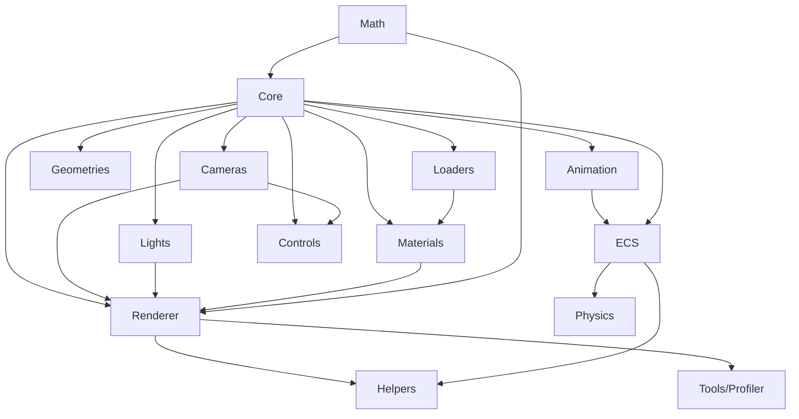

# VREEN Architecture

> Version 0.5.x · Last updated 2026-07-23
>
> This document describes the architecture of the **VREEN** project — a
> browser-first 3D engine and asset inspection platform built around a
> self-developed WebGL2 rendering kernel. For a higher-level overview see
> [`README.md`](./README.md); for the project plan see
> [`ROADMAP.md`](./ROADMAP.md); for contribution flow see
> [`CONTRIBUTING.md`](./CONTRIBUTING.md).

---

## Table of Contents

1. [System Overview](#1-system-overview)
2. [Layered Architecture](#2-layered-architecture)
3. [Engine Module Map](#3-engine-module-map)
4. [Core Subsystems](#4-core-subsystems)
   - 4.1 [Core (Scene Graph)](#41-core-scene-graph)
   - 4.2 [Math Library](#42-math-library)
   - 4.3 [Renderer](#43-renderer)
   - 4.4 [Materials](#44-materials)
   - 4.5 [Lights](#45-lights)
   - 4.6 [Cameras](#46-cameras)
   - 4.7 [Loaders & Asset Pipeline](#47-loaders--asset-pipeline)
   - 4.8 [Animation](#48-animation)
   - 4.9 [Entity-Component-System](#49-entity-component-system)
   - 4.10 [Physics](#410-physics)
   - 4.11 [Controls](#411-controls)
   - 4.12 [Geometries](#412-geometries)
   - 4.13 [Helpers & Debug](#413-helpers--debug)
   - 4.14 [Tools (Profiler)](#414-tools-profiler)
5. [Render Pipeline](#5-render-pipeline)
6. [ECS Architecture](#6-ecs-architecture)
7. [Dual-Backend Rendering](#7-dual-backend-rendering)
8. [`.vreen` Package Format](#8-vreen-package-format)
9. [Blockly Visual Scripting Integration](#9-blockly-visual-scripting-integration)
10. [UI / State Layer](#10-ui--state-layer)
11. [Build & Distribution](#11-build--distribution)
12. [Design Decisions and Trade-offs](#12-design-decisions-and-trade-offs)
13. [Glossary](#13-glossary)

---

## 1. System Overview

VREEN (Vector Render Engine ENvironment) is a single codebase that
simultaneously delivers three things:

1. **A self-developed WebGL2 3D engine** — `@vreen/engine`, distributed
   both in-tree (`src/engine/`) and as a standalone npm package
   (`packages/engine/`). It is the strategic core of the project.
2. **A 3D inspector / web authoring tool** — a React 18 SPA with a
   Three.js + React Three Fiber viewer path *and* a self-developed engine
   viewer path, switchable at runtime.
3. **A portable asset format and toolchain** — the `.vreen` ZIP container
   with multi-language SDKs (TypeScript, Java, Kotlin, C#, C++) and a CLI.

The project is intentionally small in scope (solo-maintained, irregular
cadence) but engineered for depth: every subsystem is built from scratch
where it pays off, and reuses mature libraries (Three.js, Blockly,
Electron) where reuse is cheaper than reinvention.

```
┌───────────────────────────────────────────────────────────────────────┐
│                       Application Layer (React SPA)                   │
│  Pages · Inspector UI · Toolbar · Outliner · Profiler HUD · Blockly   │
└───────────────┬───────────────────────────────────┬───────────────────┘
                │ Zustand stores                    │ Blockly runtime
┌───────────────▼─────────────────┐  ┌──────────────▼──────────────────┐
│    Viewer / Stage adapters      │  │   EcsScriptAPI (visual script   │
│  Stage.tsx (R3F + Three.js)     │  │   bridge to World / Renderer)   │
│  CustomStage.tsx (@vreen/engine)│  └──────────────┬──────────────────┘
└───────────────┬─────────────────┘                 │
                │ single engineMode switch           │
┌───────────────▼───────────────────────────────────▼───────────────────┐
│                Engine Layer (@vreen/engine)                           │
│  Core · Math · Renderer · Materials · Lights · Cameras · Loaders     │
│  Animation · ECS · Physics · Geometries · Controls · Helpers · Tools │
└───────────────┬───────────────────────────────────────────────────────┘
                │
┌───────────────▼───────────────────────────────────────────────────────┐
│                Asset Layer (.vreen ecosystem)                         │
│  Pack / Unpack / Validate / Diff · SDKs (TS/Java/Kotlin/C#/C++)       │
│  Registry · CLI · AssetManager (LRU) · Draco / KTX2 / HDR decoders    │
└───────────────────────────────────────────────────────────────────────┘
```

### Architectural references

VREEN deliberately borrows ideas from two industry projects:

| Reference | Borrowed concepts |
|-----------|-------------------|
| [O3DE (Open 3D Engine)](https://github.com/o3de/o3de) | CES (Component-Entity-System) depth, Asset Processor pattern, Script Canvas → Blockly mapping, EMotion FX → `AnimationStateMachine`, Atom renderer Pass system → `RenderPass` abstraction. |
| [Three.js](https://github.com/mrdoob/three.js) | `Object3D` object model, `BufferGeometry` / `BufferAttribute` API surface, PBR / IBL conventions, `Renderer` interface for backend pluggability, `InstancedMesh` / `LOD`. |

---

## 2. Layered Architecture

The project is structured as four strictly separated layers. Dependencies
flow downward only.

### Layer 1 — Engine kernel (`src/engine/` → `packages/engine/`)

The reusable 3D engine. **Zero runtime dependencies** (Draco is an
optional peer). Strict TypeScript, ES2020+ target, ESM-only. Anything
that needs React, Zustand, i18next or the application logger is forbidden
here — the engine ships its own minimal `logger.ts` and `setLoggerSink`
indirection so the host application can route logs.

### Layer 2 — Application adapters (`src/components/viewer/`)

React components that own a canvas and drive a renderer. Two adapters
exist:

- `Stage.tsx` — React Three Fiber (`@react-three/fiber`) hosting a
  Three.js scene. This is the legacy / mature viewer path used by
  `/viewer`.
- `CustomStage.tsx` — owns a `WebGL2Renderer` from `@vreen/engine`,
  drives its own `requestAnimationFrame` loop, and bridges the live ECS
  `World` to the renderer every frame. Used by `/engine-demo` and is the
  strategic target for `/viewer`.

Both adapters consume the same Zustand stores and respond to the same
`viewerStore.engineMode` switch.

### Layer 3 — UI / state (`src/pages/`, `src/stores/`, `src/components/`)

React 18 + React Router 6 (HashRouter) + Zustand 4. Five stores split by
domain: `viewerStore`, `uiStore`, `worldStore`, `profilerStore`,
`inspectorStore`. All user-visible strings flow through i18next keys.

### Layer 4 — Asset tooling (`packages/`, `sdks/`, `scripts/`, `docs/format/`)

The `.vreen` format is a documented, versioned, language-agnostic
container. The TypeScript tooling lives in `src/lib/vreen*.ts`, the CLI
in `scripts/vreen-cli.mjs`, and per-language SDKs under `packages/` and
`sdks/`. Each SDK is independently buildable and round-trip tested
against the canonical format spec.

---

## 3. Engine Module Map

The engine is organised into 13 top-level directories under
`src/engine/`. Each directory exports through a barrel `index.ts` and is
re-exported from the engine root `src/engine/index.ts`.

```
src/engine/
├── Core/         Scene graph primitives (Object3D, Scene, Mesh, …)
├── Math/         Vectors, matrices, quaternions, geometry primitives
├── Cameras/      Perspective / Orthographic cameras
├── Controls/     OrbitControls
├── Lights/       Ambient / Directional / Point / Spot / Hemisphere / RectArea
├── Geometries/   Procedural primitive geometry
├── Materials/    StandardMaterial, ShaderMaterial, GLSL chunks
├── Renderer/     Renderer interface, WebGL2Renderer, ShaderProgram, RenderPass
├── Loaders/      GLB / OBJ / FBX / HDR / KTX2 / Draco / AssetManager
├── Animation/    Clip, Mixer, StateMachine, BlendSpace1D, Humanoid
├── ECS/          World, ComponentType, Systems, Physics, Prefab, QueryBuilder
├── Physics/      PhysicsDemo scene
├── Helpers/      GridHelper, LineHelper, PhysicsDebugRenderer
└── Tools/        Profiler (ring-buffer frame profiler)
```

### Module dependency graph

The dependency direction is enforced by TypeScript imports and validated
by the engine barrel. Cycles are explicitly broken (see
[ComponentType](#49-entity-component-system)).



---

## 4. Core Subsystems

### 4.1 Core (Scene Graph)

**Path:** `src/engine/Core/`

The scene graph is modelled on Three.js' object model — `Object3D` is a
tree node with a local transform, world matrix, parent / children list,
and a `frustumCulled` flag — but is implemented from scratch with the
following deliberate deviations:

| Class | Role |
|-------|------|
| `Object3D` | Base node. Holds `position` / `rotation` / `scale` (`Vector3` / `Euler` / `Vector3`), `quaternion`, `matrix` (local), `matrixWorld` (cached world), `updateWorldMatrix(force, ancestors)`, `lookAt(x,y,z)`, `traverse(callback)`, `frustumCulled: boolean`. |
| `Scene` | Root container. Adds `background` (color or `{ envMap }`), `ambientLight`, and is the iteration root for the renderer. |
| `Group` | Non-renderable grouping node (no geometry / material). |
| `Mesh` | Renderable leaf. Binds a `BufferGeometry` and a `Material`. |
| `SkinnedMesh` | GPU skinning node. Holds a `Skeleton` and per-bone `Matrix4` array uploaded as a uniform array. |
| `Bone` / `Skeleton` | Bone tree + skinning palette. |
| `BufferGeometry` | Vertex / index buffers. Attributes are `BufferAttribute` with `version` counters; the renderer caches VAOs keyed on geometry `version`. |
| `BufferAttribute` | Typed-array view + `itemSize` + `version` + `needsUpdate` flag + `setUsage` shim. |
| `Material` | Abstract material interface; `BasicMaterial` is the trivial concrete impl. |
| `Texture` | GPU texture wrapper with `version`, `needsUpdate`, format / wrap / filter options. |
| `InstancedMesh` | Per-instance matrix array rendered via `gl.drawElementsInstanced`. |
| `LOD` | Multi-level mesh switching based on camera distance. |

**Design note — versioned invalidation:** the renderer does not poll
attributes every frame. Each `BufferAttribute` and `Texture` carries a
monotonic `version` integer; the renderer caches GPU state per-object and
only re-uploads when the version changes. This mirrors Three.js' approach
and keeps per-frame GPU traffic minimal.

### 4.2 Math Library

**Path:** `src/engine/Math/`

A complete math library with explicit scratch-object reuse to avoid
per-frame GC pressure. Every class exposes both mutating and
non-mutating variants where it matters.

| Export | Highlights |
|--------|-----------|
| `Vector2` / `Vector3` / `Vector4` | `add` / `sub` / `multiplyScalar` / `dot` / `cross` / `length` / `normalize` / `lerp` / `clamp` / `clampLength` / `applyMatrix4` / `applyQuaternion`. |
| `Matrix3` / `Matrix4` | Column-major `Float32Array`. `multiply` / `multiplyMatrices` / `invert` / `transpose` / `makeRotationFromQuaternion` / `makeLookAt` / `makePerspective` / `makeOrthographic`. |
| `Quaternion` | Unit quaternions. `multiply` / `slerp` / `rotateVector` / `setFromEuler` / `setFromAxisAngle` / `angleTo`. |
| `Euler` | Euler angles with `order` (`'XYZ'` / `'YXZ'` / …). |
| `Box3` / `Sphere` / `Plane` / `Ray` / `Line3` / `Triangle` | Bounding and intersection primitives. `Box3.intersectSphere`, `Ray.intersectTriangle`, `Plane.distanceToPoint`, etc. |
| `Frustum` | 6-plane view-projection frustum. `setFromMatrix(m)` / `intersectsObject(obj)` / `intersectsBox(box)`. Used by the renderer for frustum culling. |
| `Color` | Linear / sRGB color with `setFromRGB` / `convertSRGBToLinear` / `lerp`. |
| `MathUtils` | Constants (`DEG2RAD`, `RAD2DEG`), `clamp`, `lerp`, `smoothstep`, `degToRad`, `randFloat`, `randInt`, `euclideanModulo`. |

**Coordinate convention:** right-handed, +Y up, -Z forward (same as
Three.js). Camera looks down -Z by default.

### 4.3 Renderer

**Path:** `src/engine/Renderer/`

The renderer subsystem has three layers:

```
Renderer (interface)        ← pluggable backend contract
   └── WebGL2Renderer       ← concrete WebGL2 implementation
          ├── ShaderProgram ← GLSL program cache + uniform setters
          └── RenderPass    ← post-processing pass abstraction
                 └── PostProcessingPipeline
                      ├── BloomPass
                      ├── ChromaticAberrationPass
                      ├── VignettePass
                      └── FinalComposePass
```

#### `Renderer` interface (`Renderer.ts`)

A deliberately narrow abstract interface, defined in Phase 2.1.1:

```ts
export interface Renderer {
  readonly canvas: HTMLCanvasElement;
  render(scene: Scene, camera: Camera): void;
  resize(width: number, height: number): void;
  dispose(): void;
  readonly stats: RendererStats;
}
```

Invariants (documented in source):
- `render()` is synchronous; GPU commands are queued immediately.
- `resize()` is idempotent — same size does not trigger reallocation.
- `dispose()` invalidates all GPU resources; calling `render()` afterward
  is undefined.
- Backend-specific capabilities (program cache, post-processing toggles,
  shadow map config) are *not* on the interface. Callers that need them
  use the concrete `WebGL2Renderer` type.

This interface is the seam for the future WebGPU backend (Phase 5.1) and
for headless / software renderers used in unit tests.

#### `WebGL2Renderer` (`WebGL2Renderer.ts`)

Concrete implementation. Owns the WebGL2 context and manages three
resource caches:

| Cache | Key | Invalidated by |
|-------|-----|----------------|
| `MeshResources` (VAO + VBOs) | `geometry.uuid` | `geometry.version` |
| `ShadowResources` (depth FBO + texture) | `light.uuid` | light `castShadow` toggle / shadow map size change |
| `PostProcessingResources` (FBOs + textures) | canvas size | `resize()` |

Public stats (`RendererStats`):
- `drawCalls` — total draw calls this frame
- `triangles` — total triangles this frame
- `shadowPasses` — number of shadow passes (== cast-shadow lights)
- `programs` — size of the program cache
- `drawCallBreakdown` — per-mesh breakdown keyed on `mesh.name`

Toggles exposed on the concrete class:
`ssaoEnabled`, `postProcessingEnabled`, `bloomEnabled`,
`bloomIntensity`, `bloomThreshold`, `chromaticAberrationEnabled`,
`chromaticAberrationOffset`, `vignetteEnabled`, `vignetteDarkness`.

#### `ShaderProgram` (`ShaderProgram.ts`)

GLSL ES 3.0 (`#version 300 es`) program wrapper with:
- Type-safe uniform setters: `setUniform1i`, `setUniform1f`,
  `setUniform3f`, `setUniformMatrix4fv`, etc.
- `computeHash()` for variant caching — material attribute combinations
  hash to a stable program key so visually identical materials share
  programs.
- Program cache lives on the renderer; `getProgramFor(material, skinned)`
  is the lookup entry point.

> **Historical note:** `setUniform1i` previously called `uniform1f` by
> mistake, raising `GL_INVALID_OPERATION (1282)` on every draw call. The
> fix added a type-self-check assertion to prevent regressions. See
> `ROADMAP.md` tech-debt list.

#### `RenderPass` (`RenderPass.ts`)

Abstract composable post-processing pass, added in Phase 2.1.2 to
replace a previously hard-coded 5-pass chain:

```ts
export abstract class RenderPass {
  abstract apply(ctx: PassContext, input: WebGLTexture, output: WebGLFramebuffer): void;
}
```

Concrete passes: `BloomPass`, `ChromaticAberrationPass`, `VignettePass`,
`FinalComposePass`. The `PostProcessingPipeline` owns the FBOs and
executes the pass array in order, ping-ponging between two textures.

### 4.4 Materials

**Path:** `src/engine/Materials/`

| Export | Role |
|--------|------|
| `StandardMaterial` | PBR material. Properties: `baseColor` (`{ r, g, b }`), `metallic`, `roughness`, `emissive`, `opacity`, `wireframe`. Procedural texture slots. |
| `ShaderMaterial` | Custom-shader material. Accepts `vertexSrc` / `fragmentSrc` (GLSL ES 3.0 strings) and a `uniforms` descriptor. The renderer injects `u_time`, `u_model`, `u_view`, `u_projection`, `u_normalMatrix`, `u_cameraPos` automatically. |
| `ShaderChunks` | Shared vertex / fragment GLSL blocks (`#version 300 es` head, attribute / uniform declarations, PBR functions, shadow sampling). |
| `shaders.ts` | Built-in shader source: `STANDARD_VERTEX_SRC` / `STANDARD_FRAGMENT_SRC`, shadow / depth-normal / SSAO / post-processing shaders. |

**Variant caching:** `WebGL2Renderer.getProgramFor(material, skinned)`
returns one of two cached programs (standard / skinned) and uses uniform
values to differentiate materials. This is adequate for small scenes;
larger scenes will need shader keys composed from material attribute
combinations (Three.js approach — tracked in Phase 3.3, material-graph
blocks).

### 4.5 Lights

**Path:** `src/engine/Lights/`

| Export | Role |
|-------|------|
| `Light` | Base class. `color`, `intensity`. |
| `AmbientLight` | Flat ambient term. |
| `DirectionalLight` | Sun-like. `direction` vector, `castShadow` flag, `DirectionalLightShadow` config (map size, bias). |
| `PointLight` | Radial point light with attenuation. |
| `SpotLight` | Cone with inner / outer angle. |
| `HemisphereLight` | Sky / ground two-color ambient. |
| `RectAreaLight` | Rectangular area light (used for IBL-style fill). |

The renderer collects lights per-scene via `_collectLights(scene)`. Light
collection is one of the known O(n²) hotspots targeted for caching in
Phase 2.2.

### 4.6 Cameras

**Path:** `src/engine/Cameras/`

| Export | Role |
|--------|------|
| `Camera` | Base class. Holds `viewMatrix` / `projectionMatrix` / `viewProjectionMatrix`. |
| `PerspectiveCamera` | FOV / aspect / near / far. `updateProjectionMatrix()` recomputes perspective. |
| `OrthographicCamera` | left / right / top / bottom / near / far. |

Both produce a view-projection matrix consumed by the renderer and by
`Frustum.setFromMatrix()` for culling.

### 4.7 Loaders & Asset Pipeline

**Path:** `src/engine/Loaders/`

| Export | Role |
|--------|------|
| `Loader<T>` | Abstract loader interface: `load(source, ctx): Promise<T>`. |
| `AssetManager` | Registry + LRU cache. `register(ext, loader)`, `load(ext, url)`. Hit / miss / eviction logging. `getDefaultAssetManager()` returns a process-wide singleton. |
| `GLBLoader` | Binary glTF. Staged logging (`load` → `read` → `parseGLB` → `buildFromGltf`). Draco via `DracoDecoder`. |
| `OBJLoader` / `OBJExporter` | Wavefront OBJ import (`parseOBJ`) and string export (`exportOBJ`). |
| `FBXLoader` | FBX binary parsing (model + material + animation extraction). |
| `HDRLoader` | Radiance `.hdr` with **per-channel RLE** RGBE → Float32 decode. Covers compressed, uncompressed, and mixed-encoding scanline variants. |
| `KTX2Loader` | KTX2 / Basis Universal texture decompression. Pluggable `setBasisTranscoder` / `setZstdDecoder`. |
| `TextureLoader` | Image texture loading. |
| `DracoDecoder` | `draco3d` wrapper. `getDracoModule()`, `decodeDraco(...)`. Optional peer dependency. |

**Draco is an optional peer dependency.** If `draco3d` is not installed,
Draco-compressed GLBs raise a clear error rather than failing silently.

### 4.8 Animation

**Path:** `src/engine/Animation/`

```
AnimationClip ──holds──→ KeyframeTrack[] ──typed by──→ Number | Vector | Quaternion
     │
     ▼
AnimationAction ──played by──→ AnimationMixer ──drives──→ SkinnedMesh bone matrices
     │
     ▼
AnimationStateMachine ──binds to──→ AnimationMixer
     │  states: AnimMachineState { name, clip, loop }
     │  transitions: AnimTransition { from, to, condition, durationMs }
     ▼
AnimStateSystem (ECS) ──ticks per frame──→ AnimationStateMachine
```

| Export | Role |
|--------|------|
| `KeyframeTrack` + `NumberKeyframeTrack` / `VectorKeyframeTrack` / `QuaternionKeyframeTrack` | Typed keyframe tracks with `InterpMode` (linear / step / cubic). |
| `AnimationClip` | Clip = track collection + duration + `AnimationEvent[]` (time-anchored callbacks). |
| `AnimationAction` | Per-clip playback control. `play` / `pause` / `stop` / `seek` / `timeScale` / `LoopMode`. |
| `AnimationMixer` | Drives GPU skinning matrices on a root `Object3D`. Supports blending. |
| `AnimationStateMachine` | Idle / Walk / Run automatic transitions driven by `Velocity` magnitude, with configurable transition times. |
| `BlendSpace1D` | Smooth 1-D animation blending by speed (Idle ↔ Walk ↔ Run). |
| `buildHumanoid()` | Humanoid rig definitions (`HumanoidBundle`). |
| Animation events | Time-anchored callbacks (e.g. footstep triggers) firing during `AnimationAction.update`. |

**`AnimState` name collision:** the animation FSM exposes a *type*
`AnimMachineState` (a state node) while the ECS exposes a *class*
`AnimState` (an ECS component). The engine root barrel re-exports the
type as `AnimStateNode` to disambiguate; sub-barrels preserve the
original names.

### 4.9 Entity-Component-System

**Path:** `src/engine/ECS/`

The ECS is the architectural backbone of the engine. It is modelled on
O3DE's CES principles with POJO components for serializability.

#### Entity model

An **Entity** is a 32-bit packed ID:

```
  version (12 bits)  │  index (20 bits)
  ─────────────────  ──────────────────
   ↑ bumped each time the index is reused → stale references are detectable.
```

Helpers: `packEntityId(index, version)`, `entityIndex(id)`,
`entityVersion(id)`, `isValidEntityId(id, current)`.

#### Component model

A **Component** is a plain TypeScript class instance. Each component
class is registered with a `ComponentType<T>` (a string-ID singleton).
The string ID avoids the circular-import problem that arises when
components reference the `World` type — `ComponentType` is split into its
own file (`ComponentType.ts`) so `Components.ts` can import it without
going through `World.ts`.

Built-in components (in `Components.ts`):

| Component | Field highlights |
|-----------|------------------|
| `Transform` | `position` / `rotation` / `scale` / `parent` |
| `Velocity` | `vx` / `vy` / `vz` |
| `PlayerInput` | `move` / `look` / `jump` / `sprint` |
| `AnimState` | `currentState` / `nextState` / `transitionT` |
| `MeshRef` | `mesh: Mesh` (non-POJO, skipped in `toJSON`) |
| `SkinnedMeshRef` | `mesh: SkinnedMesh` (non-POJO) |
| `Health` | `current` / `max` |
| `Tag` | `name: string` |
| `Lifetime` | `remaining: number` |

Physics components (in `PhysicsComponents.ts`):
`Rigidbody`, `Collider` (AABB / Sphere / Capsule), `Particle`,
`ParticleEmitter`, `PhysicsConfig`, `PhysicsDebug`.

`NON_POJO_COMPONENTS` is a `Set<string>` listing components that hold
runtime object references and must be re-attached by the caller after
`World.toJSON()` / `World.loadJSON()`.

#### World

```ts
class World {
  createEntity(name?: string): EntityId;
  destroyEntity(id: EntityId): void;
  addComponent<T>(id: EntityId, component: T): void;
  getComponent<T>(id: EntityId, type: ComponentType<T>): T | undefined;
  removeComponent(id: EntityId, type: ComponentType): void;
  query(...types: ComponentType[]): EntityId[];
  addSystem(system: System): void;
  update(dt: number): void;
  toJSON(): WorldJson;
  loadJSON(json: WorldJson): void;
}
```

Invariants (enforced / documented in `World.ts`):
- `ComponentType.id` is globally unique; destroying a `ComponentType` is
  forbidden.
- Inside `World.update(dt)`, systems read component data only. Systems
  that need to mutate call `setComponent` (deferred-apply semantics
  inside the iteration).
- `query(...types)` returns a fresh array each call (safe for structural
  mutation during iteration). Hot paths should use `QueryBuilder` with
  caching instead.

#### Systems

`System` is a plain class with `priority: number` and
`update(world: World, dt: number): void`. The World iterates systems in
ascending `priority` order. Built-in systems (in `Systems.ts`):

| System | Role |
|--------|------|
| `MovementSystem` | Integrates `Velocity` into `Transform.position`. |
| `AnimationTickSystem` | Advances `AnimationMixer` per `SkinnedMeshRef`. |
| `AnimStateSystem` | Ticks `AnimationStateMachine` based on `Velocity` magnitude. |
| `PlayerInputSystem` | Translates `PlayerInput` into `Velocity` (camera-relative). |
| `LifetimeSystem` | Destroys entities whose `Lifetime.remaining <= 0`. |

Physics systems (in `PhysicsSystems.ts`):
`PhysicsSystem`, `CollisionSystem`, `ParticleSystem`,
`PhysicsDebugSystem` — see [§4.10](#410-physics).

#### Prefab

`Prefab` holds a list of entity templates (components + transforms) and
instantiates them with `instantiate(world): EntityId[]`. Supports nested
prefabs and per-instance overrides via `InstantiateOptions`.

#### QueryBuilder

`QueryBuilder` provides a fluent, cached query API for high-frequency
system iteration:

```ts
const movers = new QueryBuilder(world)
  .with(TransformC, VelocityC)
  .without(TagC)
  .build();  // returns EntityId[] cached and invalidated on structural change
```

#### Broadphase

`Broadphase` provides spatial acceleration for collision detection,
replacing the naive O(n²) narrowphase. Pluggable; default implementation
is a uniform grid.

### 4.10 Physics

**Path:** `src/engine/Physics/` + `src/engine/ECS/PhysicsSystems.ts`

The physics simulator is a fixed-step semi-implicit Euler integrator with
quaternion rotation integration. It is *not* a third-party engine — it
is implemented from scratch for educational transparency and to keep the
runtime dependency surface at zero.

Pipeline (per fixed step):

```
1. PhysicsSystem.integrate     ─→  apply forces → velocity → position → quaternion
2. Broadphase.update           ─→  build candidate pairs
3. CollisionSystem.narrowphase ─→  AABB / Sphere / Capsule contact manifold
4. CollisionSystem.resolve     ─→  impulse response + Baumgarte stabilization
5. ParticleSystem.update       ─→  advance particles, spawn from emitters
6. PhysicsDebugSystem.record   ─→  push lines / contacts to PhysicsDebugRenderer
```

Colliders supported: `AABB`, `Sphere`, `Capsule`.

`PhysicsDemo` (`src/engine/Physics/PhysicsDemo.ts`) ships a 24-body
scene with random boxes and a particle emitter, exercisable from the
`PHYSICS` and `PHYS-DBG` toolbar toggles in the inspector.

### 4.11 Controls

**Path:** `src/engine/Controls/`

`OrbitControls` — orbit / pan / dolly input handling for the
self-developed engine path. Mirrors the Three.js `OrbitControls` API
(`target`, `enableDamping`, `minDistance` / `maxDistance`,
`minPolarAngle` / `maxPolarAngle`, `update()`) but operates on the
engine's own `PerspectiveCamera`.

### 4.12 Geometries

**Path:** `src/engine/Geometries/`

Procedural primitive geometry generators. Each produces a
`BufferGeometry` with position / normal / uv / index attributes.

| Export | Parameters |
|--------|------------|
| `BoxGeometry` | width, height, depth, widthSegments, … |
| `SphereGeometry` | radius, widthSegments, heightSegments, … |
| `PlaneGeometry` | width, height, widthSegments, heightSegments |
| `CylinderGeometry` | radiusTop, radiusBottom, height, radialSegments, … |
| `ConeGeometry` | radius, height, radialSegments, … |
| `CapsuleGeometry` | radius, length, capSegments, radialSegments |
| `CircleGeometry` | radius, segments |
| `RingGeometry` | innerRadius, outerRadius, thetaSegments |
| `TorusGeometry` | radius, tube, radialSegments, tubularSegments, arc |
| `TorusKnotGeometry` | radius, tube, tubularSegments, radialSegments, p, q |

`Primitives.ts` re-exports all of the above for convenience.

### 4.13 Helpers & Debug

**Path:** `src/engine/Helpers/`

| Export | Role |
|--------|------|
| `GridHelper` | Procedural ground grid mesh. |
| `LineHelper` / `LineMesh` / `createLineMesh` | Dynamic line mesh for collider / velocity / contact visualization. |
| `PhysicsDebugRenderer` | Three-channel debug overlay — cyan colliders, yellow contact normals / tangents / bitangents / depths, magenta velocity vectors. Each channel is independently toggleable. |

### 4.14 Tools (Profiler)

**Path:** `src/engine/Tools/Profiler.ts`

`Profiler` collects per-frame timing and draw-call samples in a ring
buffer (120 frames by default). Markers:

| Marker | Meaning |
|--------|---------|
| `FrameSample` | Total frame time, CPU time, GPU time (when `EXT_disjoint_timer_query` is available). |
| `ProfilerMark` | A named CPU interval (`markCpu` / `markCpuEnd`). |
| `DrawCallSample` | Draw call count + triangle count for the frame. |

The UI subscribes via `onSample` and renders the frame chart /
system-execution timeline via `FrameChart.tsx` and
`SystemTimingChart.tsx`.

---

## 5. Render Pipeline

`WebGL2Renderer.render(scene, camera)` runs the following passes per
frame. Passes 2 and 4 are optional and controlled by toggles on the
renderer.

```
┌──────────────────────────────────────────────────────────────────────┐
│  render(scene, camera)                                                │
├──────────────────────────────────────────────────────────────────────┤
│  0. Update scene world matrices (scene.updateWorldMatrix)             │
│  1. Collect lights (DirectionalLight with castShadow, others)         │
│  2. SHADOW PASS (per cast-shadow DirectionalLight)                    │
│     └─ render scene depth from light POV → shadow FBO (PCF 16-tap)    │
│  3. SSAO PASS (optional, ssaoEnabled)                                 │
│     ├─ write linear depth + view normals → half-res FBO               │
│     └─ 16-tap kernel sample → SSAO texture                            │
│  4. MAIN PASS                                                          │
│     ├─ for each Mesh in scene (frustum-culled):                       │
│     │    ├─ getProgramFor(material, skinned)                          │
│     │    ├─ bind VAO (cached on geometry.version)                     │
│     │    ├─ upload uniforms (model / view / projection / normal       │
│     │    │  matrix / camera position / lights / shadow map / IBL /    │
│     │    │  SSAO / material params)                                   │
│     │    └─ gl.drawElements / drawElementsInstanced                   │
│     └─ write to mainFbo if postProcessingEnabled, else to canvas      │
│  5. POST-PROCESSING PASS (optional, postProcessingEnabled)            │
│     └─ PostProcessingPipeline:                                        │
│        BloomPass → ChromaticAberrationPass → VignettePass             │
│        → FinalComposePass → canvas                                    │
│  6. Update stats (drawCalls / triangles / shadowPasses / breakdown)   │
└──────────────────────────────────────────────────────────────────────┘
```

### Resource invalidation

- **VAO cache** — keyed on `geometry.uuid`, invalidated when
  `geometry.version` changes (any attribute's `needsUpdate` bumps the
  geometry version).
- **Shadow FBO cache** — keyed on `light.uuid`, invalidated when
  `castShadow` toggles or the shadow map size changes.
- **Post-processing FBOs** — invalidated on `resize()`.
- **Program cache** — keyed on `material` + `skinned` boolean; uses
  `ShaderProgram.computeHash` for variant stability.

### Known performance gaps

(See `ROADMAP.md` §7 for the full audit.)

1. No frustum culling historically — `Object3D.frustumCulled` existed but
   was unused. Now active per-`Mesh`.
2. `_collectLights` traverses the full scene every frame — should be
   cached and invalidated on scene-graph changes.
3. Shadow pass and main pass both traverse the scene — should share a
   single visibility list.
4. Per-frame allocations in `Object3D.lookAt` (`new Matrix4()` per call)
   — should reuse a scratch object.

---

## 6. ECS Architecture

### World — Component — System pattern

VREEN follows the canonical ECS data model with three explicit
separations:

| Concept | Implementation | Storage |
|---------|----------------|---------|
| **Entity** | `EntityId` (32-bit packed int) | `World._entities: EntitySlot[]` indexed by `entityIndex(id)` |
| **Component** | Plain class instance registered against `ComponentType<T>` | Per-type `Map<EntityId, T>` inside `World._components` |
| **System** | Class with `priority: number` and `update(world, dt)` | `World._systems: System[]` sorted by priority |

```
┌──────────────────┐   query(types)   ┌──────────────────┐
│      System      │ ───────────────→ │      World       │
│ (e.g. Movement)  │                  │  _entities       │
└──────────────────┘                  │  _components     │
       ▲                              │  _systems        │
       │ update(world, dt)            └────────┬─────────┘
       │                                       │
       │                  addComponent / getComponent / removeComponent
       │                                       │
       │                                       ▼
       │                              ┌──────────────────┐
       └──────────────────────────────│  ComponentType   │
                                      │  TransformC      │
                                      │  VelocityC       │
                                      │  RigidbodyC      │
                                      │  …               │
                                      └──────────────────┘
```

### ECS ↔ Scene Graph bridge

The ECS and the scene graph are *parallel* structures. An entity that
should be rendered carries a `MeshRef` (or `SkinnedMeshRef`) component
pointing at a `Mesh` in the scene graph. Once per frame,
`syncMeshesFromTransforms(world)` copies the entity's `Transform`
component into the `Mesh`'s `position` / `rotation` / `scale` and bumps
`matrixWorldNeedsUpdate`.

This keeps the renderer completely ECS-unaware — it just walks the scene
graph — and lets the ECS drive game logic without entangling itself with
GPU resources.

### Serialization

`World.toJSON()` produces a `WorldJson` snapshot:
- `entities: WorldEntityJson[]` — each entity's name, version, and
  POJO-component map.
- `systems: string[]` — system class names (rebuilt by caller).
- Non-POJO components (in `NON_POJO_COMPONENTS`) are skipped; the caller
  re-attaches them after `loadJSON`.

`World.loadJSON(json)` reconstructs the world and is round-trip
tested. The snapshot is embeddable in `.vreen` packages as
`world.json`.

### ECS query patterns

```ts
// Hot path: use QueryBuilder with caching.
const movers = new QueryBuilder(world)
  .with(TransformC, VelocityC)
  .build();                       // cached, invalidated on structural change

// Cold path: ad-hoc query.
const tagged = world.query(TagC); // fresh array each call
```

---

## 7. Dual-Backend Rendering

The inspector runs in two rendering modes, toggled at runtime via
`viewerStore.engineMode`:

| Mode | Container | Backend | Status |
|------|-----------|---------|--------|
| `THREE` (default) | `Stage.tsx` | React Three Fiber + Three.js r169 | Mature; current main render path. |
| `CUSTOM` | `CustomStage.tsx` | Self-developed WebGL2 engine | Functional; `/engine-demo` showcases the pure custom pipeline. Migration to make the custom engine the default viewer path is tracked in Phase 2 / 5. |

### Why two backends?

1. **Pragmatism.** The Three.js / R3F path gives a mature, well-tested
   viewer today. The custom path is the strategic bet.
2. **Educational transparency.** Building the engine from scratch makes
   every rendering decision inspectable — useful for the project's
   indie-game-developer audience.
3. **Decoupled evolution.** The two paths share the same Zustand stores
   and ECS `World`. Improvements to the ECS, physics, or animation
   benefit both paths; the rendering layer can be migrated incrementally.

### Bridge layer

`src/three/` contains adapters between the two worlds:
- `threeToCustomAnim.ts` — Three.js animation clips → engine
  `AnimationClip`s.
- `convertCustomToThree.ts` — engine `Scene` → Three.js scene (for the
  legacy viewer path's preview of engine-built scenes).
- `loaders.ts` — Three.js loader wrappers (used by `Stage.tsx`).
- `generators.ts` — 7 procedural model generators (Three.js flavour).

---

## 8. `.vreen` Package Format

A `.vreen` file is a **ZIP container** (RFC 1951 DEFLATE, standard ZIP
local headers — compatible with `unzip`) capturing a complete 3D project
state. The authoritative specification is
[`docs/format/vreen-format-spec.md`](./docs/format/vreen-format-spec.md);
current version **0.2.1**.

### Container layout

```
<name>.vreen
├── manifest.json             required — inventory + metadata
├── scene.json                required — camera, animation, environment, post-FX, materials
├── project.json              optional — legacy 0.1.x state (mirror of scene.json)
├── world.json                optional — embedded ECS world (deterministic game state)
└── assets/
    ├── model.glb             primary 3D model (any extension)
    ├── model.fbx             additional models
    ├── textures/             image textures (<id>.png / .jpg)
    ├── hdri/                 environment maps (<id>.hdr)
    └── audio/                sound files (reserved, <id>.ogg)
```

### Format architecture

```
┌────────────────────────────────────────────────────────────────────┐
│                     .vreen ZIP container                           │
├────────────────────────────────────────────────────────────────────┤
│  manifest.json ──┬──→ asset inventory (id → path, kind)            │
│                  ├──→ metadata (name, exportedAt, generator, ver)  │
│                  └──→ primaryModelId                               │
│  scene.json   ────→ camera / animation / env / post-FX / materials │
│  world.json   ────→ ECS world snapshot (WorldJson)                 │
│  assets/*     ────→ embedded binary resources (GLB / FBX / HDR /…) │
└────────────────────────────────────────────────────────────────────┘
```

### Forward compatibility

The format is **forward-compatible**:
- Implementations MUST ignore unknown fields.
- Old versions (0.1.x with single `project.json` or plain JSON) are
  auto-migrated by current readers by sniffing the first 4 bytes
  (`PK\x03\x04` vs `{` / `[`).

### `.vreen-delta` incremental packages

A `.vreen-delta` is a ZIP containing only the **changes** from a base
`.vreen` plus enough metadata to reconstruct the head. Used for
bandwidth-efficient asset updates and collaboration workflows.

### Multi-language SDK matrix

| Language / Platform | Path | Build | Purpose |
|---------------------|------|-------|---------|
| TypeScript | `packages/engine/` (`@vreen/engine`) | esbuild + tsc | Engine + format library, zero runtime deps |
| Java POJO | `sdks/java/` | Gradle + Maven | `.vreen` read / write, round-trip tested |
| Kotlin | `packages/vreen-core/` | Maven | Build-time `.vreen` tools, diff, registry |
| C# / Unity | `packages/unity-package/` | Unity package | Editor export plugin (`VreenEditorWindow`, `VreenExporter`) |
| C++ / Unreal | `packages/unreal-plugin/` | Unreal `.uplugin` | `VreenRuntime` + `VreenEditor` modules |

### CLI

```bash
npm run vreen -- pack    <project-dir> <out.vreen>
npm run vreen -- unpack  <in.vreen>    <out-dir>
npm run vreen -- validate <in.vreen>
npm run vreen -- diff    <base.vreen> <head.vreen> <out.vreen-delta>
```

---

## 9. Blockly Visual Scripting Integration

VREEN embeds [Blockly 13](https://developers.google.com/blockly) as a
visual scripting layer bridging non-programmers to the live engine
state.

### Architecture

```
┌────────────────────┐   code gen   ┌──────────────────────┐
│  Blockly Workspace │ ───────────→ │  Generated JS        │
│  (block JSON)      │              │  (calls into API)    │
└────────────────────┘              └──────────┬───────────┘
                                               │
                                  ┌────────────┴────────────┐
                                  │                         │
                          ┌───────▼────────┐       ┌────────▼─────────┐
                          │  EcsScriptAPI  │       │  Renderer /      │
                          │  (World bind)  │       │  Camera API      │
                          └───────┬────────┘       └────────┬─────────┘
                                  │                         │
                                  ▼                         ▼
                          ┌────────────────┐       ┌────────────────────┐
                          │  ECS World     │       │  WebGL2Renderer /  │
                          │  (live)        │       │  viewerStore       │
                          └────────────────┘       └────────────────────┘
```

### Block categories (`src/lib/vreenBlockly.ts`)

| Category | Color | Covers |
|----------|-------|--------|
| **Camera** | blue | Preset switching (iso / front / back / side / top / free / 1st / 3rd / cine), position, state logging. |
| **Animation** | green | Play / pause / stop, clip selection, state queries. |
| **Scene** | — | Entity creation, transform manipulation, scene queries. |
| **Renderer** | — | Engine-mode switch, post-FX toggles, environment control. |
| **Physics** | — | Rigidbody impulses, collider queries, particle emitter config. |
| **Control** | — | Flow control — loops, conditionals, Tick registration. |

### ECS binding (`src/lib/ecsScriptApi.ts`)

`EcsScriptAPI` is a **pure-logic bridge** (no React / Zustand dependency)
that lets generated scripts operate on the live `World`:

- Entity lifecycle — `createEntity` / `destroyEntity` / `isAlive`.
- Component access — typed getters / setters for `Transform`, `Velocity`,
  `Health`, `Tag`, `Lifetime`, `PlayerInput`, `MeshRef`,
  `SkinnedMeshRef`, `AnimState`.
- Material mutation — `StandardMaterial` parameter updates.
- Animation control — `AnimationStateMachine` transitions, clip
  selection.
- Tick callbacks — `onTick(cb)` registration for per-frame script logic
  (Phase 3.2).

Component data is exchanged as JSON strings because Blockly blocks only
support `string` / `number` / `array` value types.

### O3DE Script Canvas parallel

This design parallels O3DE's Script Canvas: blocks are bound to ECS
component operations, the Tick event block parallels O3DE's
`OnTick` node, and the planned material-graph blocks (Phase 3.3)
parallel O3DE's material-node editor. See `ROADMAP.md` Phase 3 for the
full plan.

---

## 10. UI / State Layer

### Stores (`src/stores/`)

| Store | Domain |
|-------|--------|
| `viewerStore.ts` | Asset loading, camera, engine mode (`THREE` / `CUSTOM`), physics / debug / Blockly toggles. |
| `uiStore.ts` | UI state, logs, environment, post-processing, startup log. |
| `worldStore.ts` | ECS `World` reference shared with React. |
| `profilerStore.ts` | Profiler ring-buffer samples. |
| `inspectorStore.ts` | Inspector selection state. |

### Inspector components (`src/components/viewer/`)

See [`README.md` § Inspector component responsibilities](./README.md#inspector-component-responsibilities-src-components-viewer)
for the full table. Key points:

- `Stage.tsx` and `CustomStage.tsx` are the only two components that
  own a canvas. Everything else is HUD.
- `ECSPanel.tsx`, `EntityGraph.tsx`, and `ProfilerHUD.tsx` read from
  Zustand stores that the engine adapters populate each frame.
- `BlocklyPanel.tsx` is the Blockly workspace host with Run / Stop /
  Save / Load buttons.

### i18n

All user-visible strings flow through i18next keys
(`src/i18n/locales/{en,zh}.json`). `scripts/check-i18n-keys.cjs` audits
key coverage at build time. The engine itself is i18n-free — log
messages are stable strings.

---

## 11. Build & Distribution

### Build pipeline

```
src/engine/  ──sync──→  packages/engine/src/  ──esbuild──→  packages/engine/dist/
                                                              │
                                                              ▼
                                              published as @vreen/engine
                                                              │
src/ (React app)  ──vite──→  dist/  ─────────────────────────┼──→ static host
                              │                                │
                              └──electron-builder──→ release/VREEN-Portable-<v>.exe
```

### Engine package build

`scripts/sync-engine-package.mjs` copies `src/engine/` into
`packages/engine/src/`, then `scripts/rewrite-engine-imports.cjs`
rewrites `@/lib/logger` imports to the package-local `logger.ts`.
Finally `esbuild` bundles `src/index.ts` into a single ESM file
(`dist/index.js`) with `draco3d` marked external.

### Web SPA build

`npm run build` runs `tsc -b` (strict type check) then
`vite build` → static SPA in `dist/`. `vite.config.ts` sets
`base: './'` so the same `dist/` works for HTTP hosting and local
`file://` access (used by the Electron portable build).

### Electron build

`npm run electron:build` runs the SPA build, then electron-builder
packages a single-file portable Windows `.exe` into `release/`:

- `appId`: `com.toujianjian.vreen`
- `productName`: `VREEN`
- Target: `portable` (win-x64)
- Bundled files: `dist/**`, `electron/**`, `package.json`

The Electron entry (`electron/main.cjs`) loads the built SPA;
`electron/preload.cjs` exposes a minimal bridge; `electron/splash.html`
shows a launch splash.

### CI

`.github/workflows/ci.yml` triggers on push and PR to `main`:

1. Checkout (Node 20, npm cache)
2. `npm ci`
3. `npm run typecheck` — strict type check
4. `npm run build` — production build
5. `npm test` — unit test suite

A failed step blocks merge.

### Husky + lint-staged (`.husky/pre-commit`)

The `prepare` script installs Husky on `npm install`. The `pre-commit`
hook runs `lint-staged`, which currently echoes staged `.ts` / `.tsx`
files as a placeholder for future lint rules.

---

## 12. Design Decisions and Trade-offs

### Why a self-developed engine instead of pure Three.js?

| Reason | Explanation |
|--------|-------------|
| **Educational transparency** | The project targets indie developers and 3D artists who want to understand — not just consume — a 3D engine. Every rendering decision is inspectable in the codebase. |
| **Zero-dependency engine package** | `@vreen/engine` ships with zero runtime deps (Draco optional). This is impossible if the engine *is* Three.js. The package is reusable in headless servers, build pipelines, and non-web runtimes. |
| **Architectural control** | The `Renderer` interface, `RenderPass` abstraction, and ECS ↔ scene-graph bridge are designed together. Adopting Three.js wholesale would mean inheriting its `WebGLRenderer`'s internal structure. |
| **Multi-backend future** | The `Renderer` interface is the seam for a future WebGPU backend (Phase 5.1). |

**Trade-off acknowledged:** Three.js has a decade more battle-testing
and a vastly larger loader / extension ecosystem. VREEN compensates by
*also* shipping a mature Three.js + R3F viewer path (`Stage.tsx`) and
by reusing Three.js example loaders where appropriate. The dual-backend
design lets users pick the right tool per use case.

### Why ECS instead of an object-oriented component model?

| Reason | Explanation |
|--------|-------------|
| **Data locality** | Components are stored in per-type `Map`s, enabling cache-friendly system iteration. |
| **Serializable by default** | POJO components round-trip through `World.toJSON()` / `loadJSON()` and embed cleanly in `.vreen` packages. |
| **Parallel with O3DE CES** | Borrowing O3DE's CES pattern gives the project a proven architectural reference and a clear path to Prefab nesting, network sync, and snapshot diffing. |

**Trade-off acknowledged:** ECS is harder to teach than OOP component
trees. The Blockly visual scripting layer exists precisely to lower
this barrier — non-programmers manipulate the ECS through blocks instead
of TypeScript.

### Why Blockly instead of a textual scripting language?

| Reason | Explanation |
|--------|-------------|
| **Audience** | The project targets 3D artists and indie developers who may not be comfortable writing TypeScript. |
| **O3DE parallel** | O3DE's Script Canvas is the direct architectural reference. |
| **Composability** | Blocks compose into a visual graph that is easier to audit than free-form code, and the generated JS is constrained to a known-safe API surface. |

**Trade-off acknowledged:** Blockly scripts are less expressive than
TypeScript and slower to author for experienced developers. The
`EcsScriptAPI` is therefore also exposed as a regular TypeScript module
that power users can call directly from the host application.

### Why a ZIP-based `.vreen` format instead of a custom binary?

| Reason | Explanation |
|--------|-------------|
| **Inspectability** | A `.vreen` file can be opened with any standard `unzip` tool; the JSON manifests are human-readable. |
| **Multi-language SDK simplicity** | ZIP / DEFLATE / JSON have libraries in every language; a custom binary format would require hand-written codecs per SDK. |
| **Forward compatibility** | JSON-with-ignored-unknown-fields is trivially forward-compatible; binary formats require explicit version negotiation. |

**Trade-off acknowledged:** ZIP is larger and slower than a custom
binary. This is mitigated by `.vreen-delta` incremental packages for
bandwidth-sensitive workflows, and a planned `.vreen publish` mode
(Phase 4.3) that pre-compiles shaders, compresses textures, and
generates LODs at packaging time.

### Why fixed-step physics instead of variable-step?

| Reason | Explanation |
|--------|-------------|
| **Determinism** | Fixed-step integration is deterministic, which is essential for replay / recording / network sync. |
| **Stability** | Semi-implicit Euler at a fixed step is more stable than variable-step for the impulse-based collision response used here. |
| **Simplicity** | A single integration step is easier to reason about and test than a sub-stepping variable integrator. |

**Trade-off acknowledged:** Fixed-step physics can produce visual
stutter at high frame rates unless interpolated. The renderer currently
renders at the simulation state; interpolation is a future enhancement.

### Why per-channel RLE in HDRLoader?

The previous implementation decoded RLE scanlines as packed RGBE tuples.
This broke on scanlines where the RLE encoding differs per channel
(common in production `.hdr` files). The per-channel rewrite decodes R,
G, B, E independently, covering compressed, uncompressed, and
mixed-encoding scanline variants. See `ROADMAP.md` tech-debt list for
the coverage status across `.hdr` variants.

---

## 13. Glossary

| Term | Meaning |
|------|---------|
| **CES / ECS** | Component-Entity-System — an architectural pattern where entities are IDs, components are plain data, and systems iterate over components. O3DE uses "CES"; VREEN uses "ECS" interchangeably. |
| **IBL** | Image-Based Lighting — using an HDRI environment map for diffuse / specular lighting. |
| **PBR** | Physically Based Rendering — base color / metallic / roughness / emissive material model. |
| **GPU skinning** | Per-vertex bone-matrix blending on the GPU, driven by a `Skeleton` and `AnimationMixer`. |
| **POJO component** | A component whose fields are all plain JSON-serializable values (no class instances, functions, or DOM refs). |
| **Round-trip** | Serialize → deserialize → serialize produces byte-identical output. |
| **Baumgarte stabilization** | A positional correction term added after impulse-based collision resolution to push intersecting bodies apart gradually, avoiding jitter. |
| **Pass** | A single rendering operation over the scene (shadow pass, SSAO pass, main pass, post-processing pass). |
| **VAO** | Vertex Array Object — WebGL2 encapsulation of vertex attribute bindings. |
| **FBO** | Framebuffer Object — offscreen render target. |
| **PCF** | Percentage-Closer Filtering — shadow map anti-aliasing by sampling the depth texture multiple times. |
| **Script Canvas** | O3DE's visual scripting system; VREEN's Blockly integration is the direct parallel. |

---

> **VREEN** — *Vector Render Engine ENvironment*. Built by
> [toujianjian](https://github.com/toujianjian).
