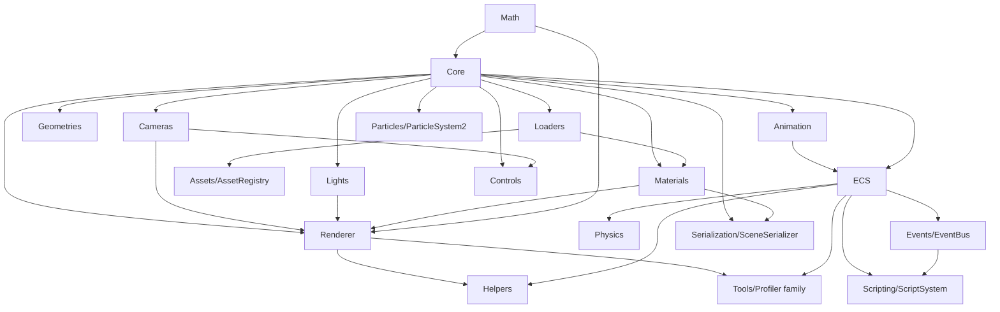

# VREEN Architecture

> Version 0.5.x · Last updated 2026-07-25 (Timeline / AI / Environment sections added)
>
> This document describes the architecture of the **VREEN** project — a
> browser-first 3D engine and asset inspection platform built around a
> self-developed WebGL2 rendering kernel. For a higher-level overview see
> [`README.md`](./README.md); for the project plan see
> [`ROADMAP.md`](./ROADMAP.md); for contribution flow see
> [`CONTRIBUTING.md`](./CONTRIBUTING.md).

---

## Table of Contents

1. [System Overview](#1-system-overview)
2. [Layered Architecture](#2-layered-architecture)
3. [Engine Module Map](#3-engine-module-map)
4. [Core Subsystems](#4-core-subsystems)
   - 4.1 [Core (Scene Graph)](#41-core-scene-graph)
   - 4.2 [Math Library](#42-math-library)
   - 4.3 [Renderer](#43-renderer)
   - 4.4 [Materials](#44-materials)
   - 4.5 [Lights](#45-lights)
   - 4.6 [Cameras](#46-cameras)
   - 4.7 [Loaders & Asset Pipeline](#47-loaders--asset-pipeline)
   - 4.8 [Animation](#48-animation)
   - 4.9 [Entity-Component-System](#49-entity-component-system)
   - 4.10 [Physics](#410-physics)
   - 4.11 [Controls](#411-controls)
   - 4.12 [Geometries](#412-geometries)
   - 4.13 [Helpers & Debug](#413-helpers--debug)
   - 4.14 [Tools (Performance Profiling)](#414-tools-performance-profiling)
   - 4.15 [Events](#415-events)
   - 4.16 [Scripting](#416-scripting)
   - 4.17 [Particles](#417-particles)
   - 4.18 [Audio](#418-audio)
   - 4.19 [Terrain](#419-terrain)
   - 4.20 [Acceleration](#420-acceleration)
   - 4.21 [Assets](#421-assets)
   - 4.22 [Serialization](#422-serialization)
   - 4.23 [Input](#423-input)
   - 4.24 [Network](#424-network)
   - 4.25 [SaveSystem](#425-savesystem)
   - 4.26 [SceneManager](#426-scenemanager)
   - 4.27 [AI](#427-ai)
   - 4.28 [Environment](#428-environment)
   - 4.29 [Timeline](#429-timeline)
5. [Render Pipeline](#5-render-pipeline)
6. [ECS Architecture](#6-ecs-architecture)
7. [Dual-Backend Rendering](#7-dual-backend-rendering)
8. [`.vreen` Package Format](#8-vreen-package-format)
9. [Blockly Visual Scripting Integration](#9-blockly-visual-scripting-integration)
10. [UI / State Layer](#10-ui--state-layer)
11. [Build & Distribution](#11-build--distribution)
12. [Design Decisions and Trade-offs](#12-design-decisions-and-trade-offs)
13. [Glossary](#13-glossary)

---

## 1. System Overview

VREEN (Vector Render Engine ENvironment) is a single codebase that
simultaneously delivers three things:

1. **A self-developed WebGL2 3D engine** — `@vreen/engine`, distributed
   both in-tree (`src/engine/`) and as a standalone npm package
   (`packages/engine/`). It is the strategic core of the project.
2. **A 3D inspector / web authoring tool** — a React 18 SPA with a
   Three.js + React Three Fiber viewer path *and* a self-developed engine
   viewer path, switchable at runtime.
3. **A portable asset format and toolchain** — the `.vreen` ZIP container
   with multi-language SDKs (TypeScript, Java, Kotlin, C#, C++) and a CLI.

The project is intentionally small in scope (solo-maintained, irregular
cadence) but engineered for depth: every subsystem is built from scratch
where it pays off, and reuses mature libraries (Three.js, Blockly,
Electron) where reuse is cheaper than reinvention.

```
┌───────────────────────────────────────────────────────────────────────┐
│                       Application Layer (React SPA)                   │
│  Pages · Inspector UI · Toolbar · Outliner · Profiler HUD · Blockly   │
└───────────────┬───────────────────────────────────┬───────────────────┘
                │ Zustand stores                    │ Blockly runtime
┌───────────────▼─────────────────┐  ┌──────────────▼──────────────────┐
│    Viewer / Stage adapters      │  │   EcsScriptAPI (visual script   │
│  Stage.tsx (R3F + Three.js)     │  │   bridge to World / Renderer)   │
│  CustomStage.tsx (@vreen/engine)│  └──────────────┬──────────────────┘
└───────────────┬─────────────────┘                 │
                │ single engineMode switch           │
┌───────────────▼───────────────────────────────────▼───────────────────┐
│                Engine Layer (@vreen/engine)                           │
│  Core · Math · Renderer · Materials · Lights · Cameras · Loaders     │
│  Animation · ECS · Physics · Geometries · Controls · Helpers · Tools │
└───────────────┬───────────────────────────────────────────────────────┘
                │
┌───────────────▼───────────────────────────────────────────────────────┐
│                Asset Layer (.vreen ecosystem)                         │
│  Pack / Unpack / Validate / Diff · SDKs (TS/Java/Kotlin/C#/C++)       │
│  Registry · CLI · AssetManager (LRU) · Draco / KTX2 / HDR decoders    │
└───────────────────────────────────────────────────────────────────────┘
```

### Architectural references

VREEN deliberately borrows ideas from two industry projects:

| Reference | Borrowed concepts |
|-----------|-------------------|
| [O3DE (Open 3D Engine)](https://github.com/o3de/o3de) | CES (Component-Entity-System) depth, Asset Processor pattern, Script Canvas → Blockly mapping, EMotion FX → `AnimationStateMachine`, Atom renderer Pass system → `RenderPass` abstraction. |
| [Three.js](https://github.com/mrdoob/three.js) | `Object3D` object model, `BufferGeometry` / `BufferAttribute` API surface, PBR / IBL conventions, `Renderer` interface for backend pluggability, `InstancedMesh` / `LOD`. |

---

## 2. Layered Architecture

The project is structured as four strictly separated layers. Dependencies
flow downward only.

### Layer 1 — Engine kernel (`src/engine/` → `packages/engine/`)

The reusable 3D engine. **Zero runtime dependencies** (Draco is an
optional peer). Strict TypeScript, ES2020+ target, ESM-only. Anything
that needs React, Zustand, i18next or the application logger is forbidden
here — the engine ships its own minimal `logger.ts` and `setLoggerSink`
indirection so the host application can route logs.

### Layer 2 — Application adapters (`src/components/viewer/`)

React components that own a canvas and drive a renderer. Two adapters
exist:

- `Stage.tsx` — React Three Fiber (`@react-three/fiber`) hosting a
  Three.js scene. This is the legacy / mature viewer path used by
  `/viewer`.
- `CustomStage.tsx` — owns a `WebGL2Renderer` from `@vreen/engine`,
  drives its own `requestAnimationFrame` loop, and bridges the live ECS
  `World` to the renderer every frame. Used by `/engine-demo` and is the
  strategic target for `/viewer`.

Both adapters consume the same Zustand stores and respond to the same
`viewerStore.engineMode` switch.

### Layer 3 — UI / state (`src/pages/`, `src/stores/`, `src/components/`)

React 18 + React Router 6 (HashRouter) + Zustand 4. Five stores split by
domain: `viewerStore`, `uiStore`, `worldStore`, `profilerStore`,
`inspectorStore`. All user-visible strings flow through i18next keys.

### Layer 4 — Asset tooling (`packages/`, `sdks/`, `scripts/`, `docs/format/`)

The `.vreen` format is a documented, versioned, language-agnostic
container. The TypeScript tooling lives in `src/lib/vreen*.ts`, the CLI
in `scripts/vreen-cli.mjs`, and per-language SDKs under `packages/` and
`sdks/`. Each SDK is independently buildable and round-trip tested
against the canonical format spec.

---

## 3. Engine Module Map

The engine is organised into top-level directories under
`src/engine/`. Each directory exports through a barrel `index.ts` and is
re-exported from the engine root `src/engine/index.ts`.

```
src/engine/
├── Core/         Scene graph primitives (Object3D, Scene, Mesh, Sprite, Text, BitmapText, …) + texture family + Source + MorphTargets/MorphTargetAnimation + InstancedBufferAttribute + FurShell (multi-layer fur) + Fog / Raycaster + DirtyFlag / SceneGraphProcessor / FrustumCuller / SceneStats + TextAtlas
├── Math/         Vectors, matrices, quaternions, geometry primitives
├── Cameras/      Perspective / Orthographic cameras
├── Controls/     Orbit / Fly / PointerLock / Map controls
├── Lights/       Ambient / Directional / Point / Spot / Hemisphere / RectArea + ShadowMapManager
├── Geometries/   Procedural primitive geometry (15 generators)
├── Materials/    Standard / Physical / Basic / Phong / Normal / Shadow / Sprite + ShaderMaterial + ShaderChunks/ subdirectory (10 GLSL fragments + ShaderChunkRegistry) + FurMaterial (shell-based fur / hair)
├── Renderer/     Renderer interface, WebGL2Renderer, ShaderProgram, RenderPass, ShadowMapManager + MRTTarget / GBuffer (deferred) + PostProcess/ enhanced passes + PathTracer (CPU reference path tracer)
├── Loaders/      GLB / OBJ / FBX / HDR / KTX2 / STL / PLY / TGA / MTL / EXR / Draco / AssetManager + 4 exporters (OBJ / GLTF / STL / PLY)
├── Animation/    Clip, Mixer, StateMachine, BlendSpace1D, Humanoid + AnimationLayer / AnimationLayerMixer / BoneMask / AvatarMask / AdditiveBlend / AnimationSync + IK (FABRIK / CCD)
├── ECS/          World, ComponentType, Systems, Physics, Prefab, QueryBuilder + Constraints
├── Physics/      PhysicsDemo scene + ConstraintSolver + Joint constraints (Ball/Hinge/Slider/Fixed/Distance) + ClothSimulation (Verlet soft body)
├── Helpers/      Grid / Grid3D / Axes / Box / Camera / Arrow helpers + PhysicsDebugRenderer
├── Events/       EventBus / EventQueue / GameEvent (typed pub/sub)
├── Scripting/    ScriptComponent / ScriptSystem / ScriptRegistry / CoroutineSystem
├── Particles/    ParticleSystem2 / ParticleEmitter / ParticleModifier / ParticleCurve / TrailModule (advanced CPU particle system, separate from ECS ParticleSystem)
├── Audio/        AudioListener / PositionalAudio / Audio / AudioLoader / AudioAnalyser
├── Terrain/      TerrainGeometry / HeightmapGenerator / TerrainSplat / TerrainLayer
├── Acceleration/ BVH / BVHBuilder / MeshBVH
├── Assets/       AssetCache (LRU) / AssetRegistry (ref-counting) / AssetLoader (async) — resource lifecycle management
├── Serialization/ SerializerRegistry / GeometrySerializer / MaterialSerializer / SceneSerializer — Scene/Geometry/Material ↔ JSON round-trip
├── Tools/        Profiler / FrameProfiler / SystemProfiler / MemoryTracker / GpuProfiler / PerformanceReport
├── Network/      NetworkSync (server-authoritative sync) + Snapshot (binary serialization/compression) + NetworkTransport (WebSocket/Mock) + NetworkLerp (interpolation/prediction/reconciliation)
├── SaveSystem/   SaveSystem (multi-slot + auto-save) + SaveSerializer (Scene+World ↔ SaveData, compressed) + LocalStorageAdapter (localStorage/memory fallback)
├── SceneManager/ SceneManager (multi-scene register/load/switch) + SceneTransition (Fade/Crossfade/Slide/Wipe/None)
└── Input/        InputManager (unified keyboard/mouse/touch/gamepad) + KeyboardState/MouseState/TouchState/GamepadState + InputAction (binding→action) + InputMap (JSON config)
```

### Module dependency graph

The dependency direction is enforced by TypeScript imports and validated
by the engine barrel. Cycles are explicitly broken (see
[ComponentType](#49-entity-component-system)).



---

## 4. Core Subsystems

### 4.1 Core (Scene Graph)

**Path:** `src/engine/Core/`

The scene graph is modelled on Three.js' object model — `Object3D` is a
tree node with a local transform, world matrix, parent / children list,
and a `frustumCulled` flag — but is implemented from scratch with the
following deliberate deviations:

| Class | Role |
|-------|------|
| `Object3D` | Base node. Holds `position` / `rotation` / `scale` (`Vector3` / `Euler` / `Vector3`), `quaternion`, `matrix` (local), `matrixWorld` (cached world), `updateWorldMatrix(force, ancestors)`, `lookAt(x,y,z)`, `traverse(callback)`, `frustumCulled: boolean`. |
| `Scene` | Root container. Adds `background` (color or `{ envMap }`), `ambientLight`, and is the iteration root for the renderer. |
| `Group` | Non-renderable grouping node (no geometry / material). |
| `Mesh` | Renderable leaf. Binds a `BufferGeometry` and a `Material`. |
| `SkinnedMesh` | GPU skinning node. Holds a `Skeleton` and per-bone `Matrix4` array uploaded as a uniform array. |
| `Bone` / `Skeleton` | Bone tree + skinning palette. |
| `BufferGeometry` | Vertex / index buffers. Attributes are `BufferAttribute` with `version` counters; the renderer caches VAOs keyed on geometry `version`. |
| `BufferAttribute` | Typed-array view + `itemSize` + `version` + `needsUpdate` flag + `setUsage` shim. |
| `InstancedBufferAttribute` | Per-instance vertex attribute for instanced rendering. Extends `BufferAttribute` with `meshPerAttribute` (maps to `gl.vertexAttribDivisor(loc, N)`, default 1). Used for per-instance matrices, colors, etc. |
| `Material` | Abstract material interface; `BasicMaterial` is the trivial concrete impl. |
| `Texture` | GPU texture wrapper with `version`, `needsUpdate`, format / wrap / filter options. |
| `CubeTexture` | 6-face environment map (reflection or refraction mapping); images array ordered `+X, -X, +Y, -Y, +Z, -Z`. |
| `DataTexture` | Typed-array backed (`Uint8/16/32`, `Float32`) — used for LUTs, noise, scientific data. |
| `DataArrayTexture` | 2D array texture (depth slices) — used for animation atlases, terrain tiles. Supports per-layer partial updates via `layerUpdates`. |
| `DepthTexture` | Depth / depth-stencil texture for shadow maps and depth-based post-FX; supports hardware PCF via `compareFunction`. |
| `VideoTexture` | `HTMLVideoElement` frame stream; uses `requestVideoFrameCallback` when available, else `update()` polling. |
| `CanvasTexture` | `HTMLCanvasElement` dynamic source; caller draws to canvas then calls `update()` to bump `version` and trigger GPU re-upload. `image` field is kept in sync with `canvas` so base-class helpers work. |
| `CompressedTexture` | Base class for S3TC / ETC / BPTC / PVRTC / ASTC compressed textures. Holds a `mipmaps: CompressedMipmap[]` chain (`{data: Uint8Array, width, height}`); renderer uploads via `compressedTexImage2D` per level. |
| `Source` | Texture data-source wrapper (`data` / `width` / `height` / `version` with `needsUpdate()`). Decouples pixel source from sampling state, mirroring three.js `Source`. Accepts `ImageData` / `HTMLImageElement` / `HTMLCanvasElement` / `OffscreenCanvas` / typed arrays. |
| `InstancedMesh` | Per-instance matrix array rendered via `gl.drawElementsInstanced`. |
| `LOD` | Multi-level mesh switching based on camera distance. |
| `Fog` / `FogExp2` | Linear and exponential fog. Renderer blends fragment color toward fog color by distance (`(dist-near)/(far-near)` or `1 - exp(-(density*dist)^2)`). |
| `Raycaster` / `intersectGeometry` | Ray-scene intersection; returns `Intersection[]` with `Face` / `distance` / `point` / `uv` / `object`. `MeshBVH` (Acceleration module) accelerates ray-mesh tests when attached. |
| `Sprite` | 2D billboard sprite — always faces the camera. CPU writes the camera's world rotation into `matrixWorld` during `updateMatrixWorld(force, camera)` (keeping the sprite's own position/scale), so raycast / bounds / traversal can consume `matrixWorld` directly without shader-stage geometric transforms. Raycast does unit-quad (-0.5..0.5) intersection in camera space. Pairs with `SpriteMaterial`. Does not cast shadows (matches three.js). |
| `Text` | 3D text rendering. Rasterizes characters through a `TextAtlas` into a shared texture atlas, generates a quad (2 triangles) per character into a `BufferGeometry`, rendered with `MeshBasicMaterial` + atlas texture. Supports `\n` newlines (line height = `fontSize * 1.25`) and `left` / `center` / `right` alignment. Geometry vertex units are "pixels × fontSize scale"; final world size controlled via `Object3D.scale`. Caller can supply a custom material (e.g. `SpriteMaterial`) or atlas. |
| `BitmapText` | Bitmap text variant — accepts an externally pre-rendered `TextAtlas` instead of lazily creating one. Suitable for large amounts of text sharing one atlas across many text nodes. |
| `TextAtlas` | Character texture atlas. Rasterizes characters one-by-one to a shared canvas, records per-char `AtlasChar { x, y, width, height, advance }` for UV lookup. Layout is simple row-packing (line wraps when exceeding row width). `getTexture()` returns a `CanvasTexture` whose version bumps on each new char addition, triggering GPU re-upload. Accepts an injected canvas + 2D context factory; degrades to dry-run metadata-only mode when DOM is unavailable (tests / SSR). |
| `MorphTargets` | Morph target deformation (facial expressions / shape animation). Stores `morphTargets: Map<string, Float32Array>` (absolute vertex positions), `morphInfluences: number[]` (weights, default 0), and `morphTargetDictionary: Map<string, number>` (name → index lookup). Application rule: `result[i] = base[i] + Σ_j (target_j[i] - base[i]) * influence_j`. Mounted on `mesh.morphTargets`; the renderer calls `update(geometry)` before each draw to write back the blended positions and bump `geometry.version` for GPU VBO re-upload. Caches `_basePositions` on first apply to avoid clobbering the original base. |
| `MorphTargetAnimation` | Morph target animation driver. Holds a `MorphTargets` instance + multiple `MorphTargetTrack`s (`name` + `times: Float32Array` + `values: Float32Array` scalar weight sequences). `update(dt)` advances time, binary-searches each track, linearly interpolates the weight, and writes it back to `morphTargets.morphInfluences`. Complements `AnimationMixer` — the mixer drives skeleton bone matrices (overall pose) while morph animation drives scalar weights (facial / local detail). Deliberately does not reuse `KeyframeTrack` to avoid a reverse dependency on `Object3D` / `TrackTarget`. |
| `FurShell` | Multi-layer shell fur rendering wrapper. Generates N concentric `Mesh` shells sharing the base `BufferGeometry`, each bound to a `FurMaterial` whose `shellLayer` (0..1) is set per shell. `generate()` builds the shell set (attached as children of the base mesh by default, or standalone), `update(dt)` advances the `time` uniform and re-synchronizes gravity / wind / fur-length / fur-color / density / occlusion / noise texture from the master `furMaterial` to every shell material, `setShellCount(n)` re-generates with a new layer count, `dispose()` releases per-shell materials and detaches shells. Each shell sets `castShadow = false` and an increasing `renderOrder` (100 + i) so the renderer draws them back-to-front. Pairs with `FurMaterial` for layered shell-based fur / hair rendering. |

**Design note — versioned invalidation:** the renderer does not poll
attributes every frame. Each `BufferAttribute` and `Texture` carries a
monotonic `version` integer; the renderer caches GPU state per-object and
only re-uploads when the version changes. This mirrors Three.js' approach
and keeps per-frame GPU traffic minimal. `Source.needsUpdate()` and
`CanvasTexture.update()` follow the same convention.

### 4.2 Math Library

**Path:** `src/engine/Math/`

A complete math library with explicit scratch-object reuse to avoid
per-frame GC pressure. Every class exposes both mutating and
non-mutating variants where it matters.

| Export | Highlights |
|--------|-----------|
| `Vector2` / `Vector3` / `Vector4` | `add` / `sub` / `multiplyScalar` / `dot` / `cross` / `length` / `normalize` / `lerp` / `clamp` / `clampLength` / `applyMatrix4` / `applyQuaternion`. |
| `Matrix3` / `Matrix4` | Column-major `Float32Array`. `multiply` / `multiplyMatrices` / `invert` / `transpose` / `makeRotationFromQuaternion` / `makeLookAt` / `makePerspective` / `makeOrthographic`. |
| `Quaternion` | Unit quaternions. `multiply` / `slerp` / `rotateVector` / `setFromEuler` / `setFromAxisAngle` / `angleTo`. |
| `Euler` | Euler angles with `order` (`'XYZ'` / `'YXZ'` / …). |
| `Box3` / `Sphere` / `Plane` / `Ray` / `Line3` / `Triangle` | Bounding and intersection primitives. `Box3.intersectSphere`, `Ray.intersectTriangle`, `Plane.distanceToPoint`, etc. |
| `Frustum` | 6-plane view-projection frustum. `setFromMatrix(m)` / `intersectsObject(obj)` / `intersectsBox(box)`. Used by the renderer for frustum culling. |
| `Color` | Linear / sRGB color with `setFromRGB` / `convertSRGBToLinear` / `lerp`. |
| `MathUtils` | Constants (`DEG2RAD`, `RAD2DEG`), `clamp`, `lerp`, `smoothstep`, `degToRad`, `randFloat`, `randInt`, `euclideanModulo`. |

**Coordinate convention:** right-handed, +Y up, -Z forward (same as
Three.js). Camera looks down -Z by default.

### 4.3 Renderer

**Path:** `src/engine/Renderer/`

The renderer subsystem has three layers:

```
Renderer (interface)        ← pluggable backend contract
   └── WebGL2Renderer       ← concrete WebGL2 implementation
          ├── ShaderProgram ← GLSL program cache + uniform setters
          └── RenderPass    ← post-processing pass abstraction
                 └── PostProcessingPipeline
                      ├── BloomPass
                      ├── ChromaticAberrationPass
                      ├── VignettePass
                      └── FinalComposePass
```

#### `Renderer` interface (`Renderer.ts`)

A deliberately narrow abstract interface, defined in Phase 2.1.1:

```ts
export interface Renderer {
  readonly canvas: HTMLCanvasElement;
  render(scene: Scene, camera: Camera): void;
  resize(width: number, height: number): void;
  dispose(): void;
  readonly stats: RendererStats;
}
```

Invariants (documented in source):
- `render()` is synchronous; GPU commands are queued immediately.
- `resize()` is idempotent — same size does not trigger reallocation.
- `dispose()` invalidates all GPU resources; calling `render()` afterward
  is undefined.
- Backend-specific capabilities (program cache, post-processing toggles,
  shadow map config) are *not* on the interface. Callers that need them
  use the concrete `WebGL2Renderer` type.

This interface is the seam for the future WebGPU backend (Phase 5.1) and
for headless / software renderers used in unit tests.

#### `WebGL2Renderer` (`WebGL2Renderer.ts`)

Concrete implementation. Owns the WebGL2 context and manages three
resource caches:

| Cache | Key | Invalidated by |
|-------|-----|----------------|
| `MeshResources` (VAO + VBOs) | `geometry.uuid` | `geometry.version` |
| `ShadowResources` (depth FBO + texture) | `light.uuid` | light `castShadow` toggle / shadow map size change |
| `PostProcessingResources` (FBOs + textures) | canvas size | `resize()` |

Public stats (`RendererStats`):
- `drawCalls` — total draw calls this frame
- `triangles` — total triangles this frame
- `shadowPasses` — number of shadow passes (== cast-shadow lights)
- `programs` — size of the program cache
- `drawCallBreakdown` — per-mesh breakdown keyed on `mesh.name`

Toggles exposed on the concrete class:
`ssaoEnabled`, `postProcessingEnabled`, `bloomEnabled`,
`bloomIntensity`, `bloomThreshold`, `chromaticAberrationEnabled`,
`chromaticAberrationOffset`, `vignetteEnabled`, `vignetteDarkness`.

#### `ShaderProgram` (`ShaderProgram.ts`)

GLSL ES 3.0 (`#version 300 es`) program wrapper with:
- Type-safe uniform setters: `setUniform1i`, `setUniform1f`,
  `setUniform3f`, `setUniformMatrix4fv`, etc.
- `computeHash()` for variant caching — material attribute combinations
  hash to a stable program key so visually identical materials share
  programs.
- Program cache lives on the renderer; `getProgramFor(material, skinned)`
  is the lookup entry point.

> **Historical note:** `setUniform1i` previously called `uniform1f` by
> mistake, raising `GL_INVALID_OPERATION (1282)` on every draw call. The
> fix added a type-self-check assertion to prevent regressions. See
> `ROADMAP.md` tech-debt list.

#### `RenderPass` (`RenderPass.ts`)

Abstract composable post-processing pass, added in Phase 2.1.2 to
replace a previously hard-coded 5-pass chain:

```ts
export abstract class RenderPass {
  abstract apply(ctx: PassContext, input: WebGLTexture, output: WebGLFramebuffer): void;
}
```

Concrete passes: `BloomPass`, `ChromaticAberrationPass`, `VignettePass`,
`FinalComposePass`. The `PostProcessingPipeline` owns the FBOs and
executes the pass array in order, ping-ponging between two textures.

Additional basic passes live alongside the pipeline: `SSAOPass`
(screen-space ambient occlusion), `FXAAPass` (fast approximate
anti-aliasing), `ToneMappingPass` (ACES filmic / Reinhard),
`GammaCorrectPass`, `DOFPass` (depth of field).

#### MRT / GBuffer (deferred rendering) (`MRTTarget.ts`, `GBuffer.ts`)

The renderer exposes Multi-Render Target and Geometry Buffer primitives
for deferred-rendering pipelines:

| Export | Role |
|--------|------|
| `MRTTarget` | General-purpose Multi-Render Target FBO. Holds N color attachments (`COLOR_ATTACHMENT0..N-1`) + an optional depth / stencil attachment. `setup(gl, w, h, opts)` creates GL resources; `bind(gl)` binds the FBO and configures `drawBuffers`; `unbind(gl)` restores the default FBO; `resize(gl, w, h)` reallocates textures; `dispose(gl)` releases everything. Color internal formats: `rgba8` / `rgba16f` / `rgba32f` / `rg16f` / `r16f`; default `rgba16f` (suitable for HDR G-Buffer position / normal data). Depth: `DEPTH_COMPONENT24` (uint, consistent with `ShadowMapManager`). Stencil: optional `DEPTH24_STENCIL8`. Color filter defaults to `NEAREST` (G-Buffer data should not be interpolated). Generalizes the SSAO-specific 2-attachment FBO (`_getSSAOResources`). |
| `GBuffer` | Geometry Buffer built on `MRTTarget` for deferred rendering. 4 color attachments + 1 depth: **ATTACHMENT0** `positionTexture` `RGBA16F` (xyz = world position, a = 1), **ATTACHMENT1** `normalTexture` `RGBA16F` (xyz = world normal, a = 1), **ATTACHMENT2** `albedoTexture` `RGBA8` (rgb = diffuse albedo, a = opacity), **ATTACHMENT3** `materialTexture` `RGBA8` (r = metallic, g = roughness, b = emissive, a = AO). `highPrecisionFormat` selects `rgba16f` (default) / `rgba32f` / `rgba8` for attachments 0/1. The `GBuffer` class only manages FBO / texture lifecycle — the actual geometry rendering is done by the caller (e.g. `WebGL2Renderer`'s deferred path) with a G-Buffer shader writing to the 4 `layout(location = N) out` outputs. A downstream lighting pass samples the 4 color textures to do PBR shading (optionally with SSAO / SSR). |

**Why MRT + GBuffer?** Forward rendering (the current main path) shades
each fragment once with all lights. For scenes with many lights,
forward rendering becomes fill-rate-bound. Deferred rendering shades
each screen pixel once, reading light parameters from uniforms — light
count no longer multiplies fragment work. The `GBuffer` is the input to
that lighting pass. The `MRTTarget` is the general primitive; `GBuffer`
is the canonical 4-attachment layout.

#### Enhanced post-processing passes (`PostProcess/` subdirectory)

A second family of `RenderPass` implementations lives under
`Renderer/PostProcess/`, complementing the basic passes in
`RenderPass.ts`:

| Pass | Role |
|------|------|
| `ColorGradingPass` | ASC-CDL style color grading — 8 parameters (slope / offset / power per RGB channel + saturation). |
| `LUTPass` | Color lookup table — 3D LUT or 2D strip LUT. Samples the LUT texture to remap colors. |
| `ChromaticAberrationPass` | Enhanced chromatic aberration — `Vector2` direction offset (vs. the basic float offset) + radial modulation by distance from screen center. |
| `VignettePass` | Enhanced vignette — `offset` / `darkness` + color tint (vs. the basic darkness-only version). |
| `FilmGrainPass` | Film grain — configurable strength / size / animation frame count. |
| `AfterimagePass` | Cross-frame accumulation — blends the previous frame with the current frame for motion-trail / afterimage effects. |
| `PixelationPass` | Pixelation / mosaic — downsamples to a configurable pixel size for a low-res aesthetic. |

All implement the `RenderPass` interface and compose into the same
`PostProcessingPipeline`. The `Renderer/index.ts` barrel re-exports the
enhanced versions by default; callers needing the basic versions should
import explicitly from `./RenderPass`.

> **Name-collision note:** `ChromaticAberrationPass` and `VignettePass`
> exist in *both* `RenderPass.ts` (basic) and `PostProcess/` (enhanced)
> with different option shapes. The barrel exports the enhanced
> versions.

#### `PathTracer` (`PathTracer.ts`)

CPU-simplified path tracer for reference / validation rendering. Not a
real-time backend — it is the ground-truth comparator for the WebGL2 PBR
pipeline, useful for unit tests, PBR parameter validation, and offline
debugging.

```ts
export interface PathTracerOptions {
  maxBounces?: number;       // default 8
  samplesPerPixel?: number;  // default 4
  width?: number;            // default 256
  height?: number;           // default 256
  backgroundColor?: Color;   // default black
}
```

API surface:
- `render(scene, camera)` — collects meshes / lights from the scene, then
  traces one pass per pixel (`samplesPerPixel` rays per pixel, each bounced
  up to `maxBounces` times). Increments `frameCount` and accumulates into
  the internal `Float32Array` buffer.
- `accumulate(scene, camera)` — alias for `render()`; provided so callers
  can express the progressive intent explicitly.
- `getResult()` — returns the accumulated image as a `Uint8ClampedArray`
  (averaged by `frameCount`, gamma-corrected).
- `reset()` — zeroes the accumulation buffer and `frameCount`.
- `setBounces(n)` / `setSamples(n)` — runtime configuration; both call
  `reset()`.
- `dispose()` — releases the accumulation buffer.

Internals: Möller–Trumbore ray-triangle intersection (local-variable
form to avoid scratch-buffer aliasing), cosine-weighted hemisphere
sampling for indirect bounces, direct lighting from collected lights
with shadow-ray occlusion, Russian-roulette path termination past depth
3 to bound work per ray. Camera position is extracted from
`matrixWorld.elements[12..14]` (no `setFromMatrixPosition` dependency);
camera basis is derived from `getWorldDirection()` + a synthetic up
vector. The output is *not* tonemapped — callers can post-process the
`Uint8ClampedArray` if needed.

> **Why CPU-only?** A GPU path tracer would compete with the WebGL2
> renderer for context state and complicate the test harness. The CPU
> path keeps the tracer fully deterministic and headless-testable; the
> performance cost is acceptable for the small reference images used in
> tests.

### 4.4 Materials

**Path:** `src/engine/Materials/`

| Export | Role |
|--------|------|
| `StandardMaterial` | PBR material. Properties: `baseColor` (`{ r, g, b }`), `metallic`, `roughness`, `emissive`, `opacity`, `wireframe`. Procedural texture slots. |
| `MeshPhysicalMaterial` | Extended PBR. Adds `clearcoat`, `clearcoatRoughness`, `sheen`, `sheenColor`, `IOR`, `transmission`, `thickness`, `attenuationDistance`, `attenuationColor`, `anisotropy` for dielectric / glass / fabric surfaces. |
| `MeshBasicMaterial` | Unlit — flat color or texture, ignores scene lighting; useful for sprites, debug quads, UI. |
| `MeshPhongMaterial` | Legacy Blinn-Phong with `specular` and `shininess` — for non-PBR pipelines and stylistic looks. |
| `MeshNormalMaterial` | Debug material — outputs object-space or world-space normals as RGB. |
| `ShadowMaterial` | Shadow-only receiver — reads shadow maps without contributing surface color; used for invisible shadow catchers compositing onto scene backgrounds. |
| `SpriteMaterial` | Sprite material — extends `BasicMaterial` with `color` (linear RGB, multiplied with `map`), `map` (optional color texture), `opacity`, `rotation` (radians, applied in shader around sprite center), `sizeAttenuation` (whether perspective cameras apply near-big-far-small, default true), `depthTest` / `depthWrite`, `wireframe`, `renderOrder`. Pairs with `Sprite`; the renderer uses a separate sprite shader path that implements billboard orientation in the vertex shader. `transparent` defaults to true (sprites usually have alpha). |
| `ShaderMaterial` | Custom-shader material. Accepts `vertexSrc` / `fragmentSrc` (GLSL ES 3.0 strings) and a `uniforms` descriptor. The renderer injects `u_time`, `u_model`, `u_view`, `u_projection`, `u_normalMatrix`, `u_cameraPos` automatically. Supports `onBeforeCompile(shader)` for injecting GLSL snippets into the built-in shaders without rewriting them — used by `MeshPhysicalMaterial` for clearcoat / transmission extensions. |
| `ShaderChunks/` subdirectory | 10 GLSL fragment string constants (`COMMON_CHUNK`, `LIGHTING_CHUNK`, `FOG_CHUNK` / `FOG_EXP2_CHUNK`, `NORMAL_PACK_CHUNK`, `SHADOW_CHUNK`, `ENVMAP_CHUNK`, `TONEMAP_ACES_CHUNK` / `TONEMAP_REINHARD_CHUNK`, `NOISE_CHUNK`, `UV_TRANSFORM_CHUNK`, `COLOR_SPACE_CHUNK`) + `ShaderChunkRegistry` class (with `shaderChunkRegistry` process-wide singleton) supporting `#include <name>` resolution. `registerBuiltinChunks()` registers all built-ins idempotently. `BUILTIN_SHADER_CHUNKS` is a `Record<string, string>` of all built-in fragments for one-shot registration to a custom registry. |
| `FurMaterial` | Shell-based fur / hair material. Extends `BasicMaterial` (same base as `ToonMaterial` / `OutlineMaterial`) with `furLength`, `furDensity`, `furColor` (`Color`), `furOcclusion` (root darkening, 0..1), `gravity` (`Vector3`), `wind` (`Vector3`), `noiseTexture` (`Texture \| null`), `shellLayer` (0..1, set per shell by `FurShell`), `time` (animation clock). The vertex shader (`FUR_VERT`) displaces vertices along `a_normal` by `shellLayer * furLength`, then offsets by gravity and wind scaled by `shellLayer * furLength` (top shells sway more). The fragment shader (`FUR_FRAG`) samples the noise texture (falling back to a hash-based pseudo-noise), discards fragments below a layer-dependent density threshold (`threshold = furDensity * (1 - layer² * 0.7)` — top shells are sparser), and darkens roots via `mix(1 - furOcclusion, 1.0, layer)`. `transparent` defaults to true; `doubleSided` defaults to true. Pairs with `FurShell` which manages the per-shell `shellLayer` uniform and synchronizes animation uniforms each frame. |
| `shaders.ts` | Built-in shader source: `STANDARD_VERTEX_SRC` / `STANDARD_FRAGMENT_SRC`, shadow / depth-normal / SSAO / post-processing shaders. |

**Variant caching:** `WebGL2Renderer.getProgramFor(material, skinned)`
returns one of two cached programs (standard / skinned) and uses uniform
values to differentiate materials. This is adequate for small scenes;
larger scenes will need shader keys composed from material attribute
combinations (Three.js approach — tracked in Phase 3.3, material-graph
blocks). `onBeforeCompile` invalidates the program cache when the material
shader-injection signature changes.

### 4.5 Lights

**Path:** `src/engine/Lights/`

| Export | Role |
|-------|------|
| `Light` | Base class. `color`, `intensity`. |
| `AmbientLight` | Flat ambient term. |
| `DirectionalLight` | Sun-like. `direction` vector, `castShadow` flag, `DirectionalLightShadow` config (map size, bias). |
| `PointLight` | Radial point light with distance attenuation. |
| `SpotLight` | Cone with inner / outer angle and penumbra. |
| `HemisphereLight` | Sky / ground two-color ambient. |
| `RectAreaLight` | Rectangular area light (used for IBL-style fill). |
| `ShadowMapManager` | Renderer-side shadow-map FBO / texture lifecycle manager (also exported from `Renderer/`). Centralizes per-light depth target allocation, reuse, and resize policy. |

The renderer collects lights per-scene via `_collectLights(scene)`. Light
collection is one of the known O(n²) hotspots targeted for caching in
Phase 2.2.

### 4.6 Cameras

**Path:** `src/engine/Cameras/`

| Export | Role |
|--------|------|
| `Camera` | Base class. Holds `viewMatrix` / `projectionMatrix` / `viewProjectionMatrix`. |
| `PerspectiveCamera` | FOV / aspect / near / far. `updateProjectionMatrix()` recomputes perspective. |
| `OrthographicCamera` | left / right / top / bottom / near / far. |

Both produce a view-projection matrix consumed by the renderer and by
`Frustum.setFromMatrix()` for culling.

### 4.7 Loaders & Asset Pipeline

**Path:** `src/engine/Loaders/`

| Export | Role |
|--------|------|
| `Loader<T>` | Abstract loader interface: `load(source, ctx): Promise<T>`. |
| `AssetManager` | Registry + LRU cache. `register(ext, loader)`, `load(ext, url)`. Hit / miss / eviction logging. `getDefaultAssetManager()` returns a process-wide singleton. |
| `GLBLoader` | Binary glTF. Staged logging (`load` → `read` → `parseGLB` → `buildFromGltf`). Draco via `DracoDecoder`. |
| `OBJLoader` / `OBJExporter` | Wavefront OBJ import (`parseOBJ`) and string export (`exportOBJ`). |
| `GLTFExporter` | glTF-GLB binary export — serializes engine `Scene` / `Mesh` / `Material` into a self-contained `.glb` with embedded buffers and images; round-trippable with `GLBLoader`. |
| `STLExporter` | Stereolithography (STL) mesh export — ASCII and binary variants. |
| `PLYExporter` | Polygon File Format (PLY) mesh export — ASCII and binary variants. |
| `FBXLoader` | FBX binary parsing (model + material + animation extraction). |
| `HDRLoader` | Radiance `.hdr` with **per-channel RLE** RGBE → Float32 decode. Covers compressed, uncompressed, and mixed-encoding scanline variants. |
| `KTX2Loader` | KTX2 / Basis Universal texture decompression. Pluggable `setBasisTranscoder` / `setZstdDecoder`. |
| `STLLoader` | Stereolithography CAD mesh import — ASCII and binary STL variants, returns a typed `BufferGeometry`. |
| `PLYLoader` | Polygon File Format mesh import — ASCII and binary (little / big endian) variants. |
| `TGALoader` | Truevision TGA image import — uncompressed, RLE, and color-mapped variants; returns `ImageData`-style data for `DataTexture`. |
| `MTLLoader` | Wavefront MTL material library parser; pairs with `OBJLoader` to recover PBR-ish material assignments. |
| `EXRLoader` | OpenEXR float image import for HDR textures and IBL; supports scanline and tiled variants. |
| `TextureLoader` | Image texture loading. |
| `DracoDecoder` | `draco3d` wrapper. `getDracoModule()`, `decodeDraco(...)`. Optional peer dependency. |

**Draco is an optional peer dependency.** If `draco3d` is not installed,
Draco-compressed GLBs raise a clear error rather than failing silently.

### 4.8 Animation

**Path:** `src/engine/Animation/`

```
AnimationClip ──holds──→ KeyframeTrack[] ──typed by──→ Number | Vector | Quaternion
     │
     ▼
AnimationAction ──played by──→ AnimationMixer ──drives──→ SkinnedMesh bone matrices
     │
     ▼
AnimationStateMachine ──binds to──→ AnimationMixer
     │  states: AnimMachineState { name, clip, loop }
     │  transitions: AnimTransition { from, to, condition, durationMs }
     ▼
AnimStateSystem (ECS) ──ticks per frame──→ AnimationStateMachine
```

| Export | Role |
|--------|------|
| `KeyframeTrack` + `NumberKeyframeTrack` / `VectorKeyframeTrack` / `QuaternionKeyframeTrack` | Typed keyframe tracks with `InterpMode` (linear / step / cubic). |
| `AnimationClip` | Clip = track collection + duration + `AnimationEvent[]` (time-anchored callbacks). |
| `AnimationAction` | Per-clip playback control. `play` / `pause` / `stop` / `seek` / `timeScale` / `LoopMode`. |
| `AnimationMixer` | Drives GPU skinning matrices on a root `Object3D`. Supports blending. |
| `AnimationStateMachine` | Idle / Walk / Run automatic transitions driven by `Velocity` magnitude, with configurable transition times. |
| `BlendSpace1D` | Smooth 1-D animation blending by speed (Idle ↔ Walk ↔ Run). |
| `buildHumanoid()` | Humanoid rig definitions (`HumanoidBundle`). |
| Animation events | Time-anchored callbacks (e.g. footstep triggers) firing during `AnimationAction.update`. |
| `IKBone` / `IKChain` / `IKSolver` | Inverse Kinematics — `IKChain` is a sequence of `IKBone`s with joint constraints; `IKSolver` implements Forward And Backward Reaching Inverse Kinematics (FABRIK) for general chains. |
| `CCDSolver` | Cyclic Coordinate Descent IK solver — alternative to FABRIK for stiff chains; per-iteration angle-limited. |
| `IKHumanoid` | Full biped IK rig — left/right arm, left/right leg, spine chains with side chaining and pole vectors. |

**`AnimState` name collision:** the animation FSM exposes a *type*
`AnimMachineState` (a state node) while the ECS exposes a *class*
`AnimState` (an ECS component). The engine root barrel re-exports the
type as `AnimStateNode` to disambiguate; sub-barrels preserve the
original names.

### 4.9 Entity-Component-System

**Path:** `src/engine/ECS/`

The ECS is the architectural backbone of the engine. It is modelled on
O3DE's CES principles with POJO components for serializability.

#### Entity model

An **Entity** is a 32-bit packed ID:

```
  version (12 bits)  │  index (20 bits)
  ─────────────────  ──────────────────
   ↑ bumped each time the index is reused → stale references are detectable.
```

Helpers: `packEntityId(index, version)`, `entityIndex(id)`,
`entityVersion(id)`, `isValidEntityId(id, current)`.

#### Component model

A **Component** is a plain TypeScript class instance. Each component
class is registered with a `ComponentType<T>` (a string-ID singleton).
The string ID avoids the circular-import problem that arises when
components reference the `World` type — `ComponentType` is split into its
own file (`ComponentType.ts`) so `Components.ts` can import it without
going through `World.ts`.

Built-in components (in `Components.ts`):

| Component | Field highlights |
|-----------|------------------|
| `Transform` | `position` / `rotation` / `scale` / `parent` |
| `Velocity` | `vx` / `vy` / `vz` |
| `PlayerInput` | `move` / `look` / `jump` / `sprint` |
| `AnimState` | `currentState` / `nextState` / `transitionT` |
| `MeshRef` | `mesh: Mesh` (non-POJO, skipped in `toJSON`) |
| `SkinnedMeshRef` | `mesh: SkinnedMesh` (non-POJO) |
| `Health` | `current` / `max` |
| `Tag` | `name: string` |
| `Lifetime` | `remaining: number` |

Physics components (in `PhysicsComponents.ts`):
`Rigidbody`, `Collider` (AABB / Sphere / Capsule), `Particle`,
`ParticleEmitter`, `PhysicsConfig`, `PhysicsDebug`.

`NON_POJO_COMPONENTS` is a `Set<string>` listing components that hold
runtime object references and must be re-attached by the caller after
`World.toJSON()` / `World.loadJSON()`.

#### World

```ts
class World {
  createEntity(name?: string): EntityId;
  destroyEntity(id: EntityId): void;
  addComponent<T>(id: EntityId, component: T): void;
  getComponent<T>(id: EntityId, type: ComponentType<T>): T | undefined;
  removeComponent(id: EntityId, type: ComponentType): void;
  query(...types: ComponentType[]): EntityId[];
  addSystem(system: System): void;
  update(dt: number): void;
  toJSON(): WorldJson;
  loadJSON(json: WorldJson): void;
}
```

Invariants (enforced / documented in `World.ts`):
- `ComponentType.id` is globally unique; destroying a `ComponentType` is
  forbidden.
- Inside `World.update(dt)`, systems read component data only. Systems
  that need to mutate call `setComponent` (deferred-apply semantics
  inside the iteration).
- `query(...types)` returns a fresh array each call (safe for structural
  mutation during iteration). Hot paths should use `QueryBuilder` with
  caching instead.

#### Systems

`System` is a plain class with `priority: number` and
`update(world: World, dt: number): void`. The World iterates systems in
ascending `priority` order. Built-in systems (in `Systems.ts`):

| System | Role |
|--------|------|
| `MovementSystem` | Integrates `Velocity` into `Transform.position`. |
| `AnimationTickSystem` | Advances `AnimationMixer` per `SkinnedMeshRef`. |
| `AnimStateSystem` | Ticks `AnimationStateMachine` based on `Velocity` magnitude. |
| `PlayerInputSystem` | Translates `PlayerInput` into `Velocity` (camera-relative). |
| `LifetimeSystem` | Destroys entities whose `Lifetime.remaining <= 0`. |

Physics systems (in `PhysicsSystems.ts`):
`PhysicsSystem`, `CollisionSystem`, `ParticleSystem`,
`PhysicsDebugSystem` — see [§4.10](#410-physics).

#### Prefab

`Prefab` holds a list of entity templates (components + transforms) and
instantiates them with `instantiate(world): EntityId[]`. Supports nested
prefabs and per-instance overrides via `InstantiateOptions`.

#### QueryBuilder

`QueryBuilder` provides a fluent, cached query API for high-frequency
system iteration:

```ts
const movers = new QueryBuilder(world)
  .with(TransformC, VelocityC)
  .without(TagC)
  .build();  // returns EntityId[] cached and invalidated on structural change
```

#### Broadphase

`Broadphase` provides spatial acceleration for collision detection,
replacing the naive O(n²) narrowphase. Pluggable; default implementation
is a uniform grid.

### 4.10 Physics

**Path:** `src/engine/Physics/` + `src/engine/ECS/PhysicsSystems.ts`

The physics simulator is a fixed-step semi-implicit Euler integrator with
quaternion rotation integration. It is *not* a third-party engine — it
is implemented from scratch for educational transparency and to keep the
runtime dependency surface at zero.

Pipeline (per fixed step):

```
1. PhysicsSystem.integrate     ─→  apply forces → velocity → position → quaternion
2. Broadphase.update           ─→  build candidate pairs
3. CollisionSystem.narrowphase ─→  AABB / Sphere / Capsule contact manifold
4. CollisionSystem.resolve     ─→  impulse response + Baumgarte stabilization
5. ParticleSystem.update       ─→  advance particles, spawn from emitters
6. PhysicsDebugSystem.record   ─→  push lines / contacts to PhysicsDebugRenderer
```

Colliders supported: `AABB`, `Sphere`, `Capsule`.

**Constraint subsystem** (`src/engine/Physics/`, based on the `Constraint`
base class + `RigidbodyLike` interface, decoupled from any specific
rigid-body implementation): an iterative sequential-impulse
`ConstraintSolver` runs after `CollisionSystem.resolve` each fixed step.
Constraints:

| Constraint | DOF locked | Use case |
|------------|------------|----------|
| `BallJointConstraint` | 3 rot free, 3 trans locked | Ragdoll shoulders / hips, chain links. |
| `HingeJointConstraint` | 1 rot about axis, 3 trans locked | Doors, knees, elbows. |
| `SliderJointConstraint` | 1 trans along axis, 3 rot locked | Pistons, drawers, elevators. |
| `FixedJointConstraint` | All 6 DOF locked | Rigid welds (compound bodies). |
| `DistanceJointConstraint` | Maintains fixed anchor distance | Ropes, springs, culling volumes. |

Each constraint references two `RigidbodyLike` entities plus local-space
anchor offsets; the solver iterates `iterations` times per step (default
10) and applies position correction via Baumgarte stabilization, the
same scheme used for collision response. The `Constraint` base class
exposes shared helpers: `computePointEffectiveMass`, `applyImpulse`,
`skewMat`, `mat3MulVec`, `mat3MulMat3`, `mat3Inverse`, `mat3Identity`.

**Cloth simulation** (`src/engine/Physics/ClothSimulation.ts`): a
Verlet-integration soft-body simulator, independent of the ECS
`PhysicsSystems` (soft-body shape differs significantly from rigid
bodies). Particle grid (`ClothParticle`: `position` / `prevPosition` /
`acceleration` / `pinned` / `mass` / `invMass`) + distance constraints
(`ClothConstraint`: `p1` / `p2` / `restLength` / `stiffness`) solved
PBD-style with multiple iterations per step:

```
next = pos + (pos - prev) * (1 - damping) + accel * dt²
```

Supports sphere collision (`ClothSphere`) and pinned anchor particles
(held fixed during integration). `getMeshData()` outputs flattened
`positions` / `indices` / `normals` for upload to a `BufferGeometry`;
the caller (e.g. `CustomStage` / physics demo) syncs the data to
`Mesh.geometry` each frame. Future ECS integration could wrap this as a
`ClothComponent` + `ClothSystem`.

`PhysicsDemo` (`src/engine/Physics/PhysicsDemo.ts`) ships a 24-body
scene with random boxes and a particle emitter, exercisable from the
`PHYSICS` and `PHYS-DBG` toolbar toggles in the inspector.

### 4.11 Controls

**Path:** `src/engine/Controls/`

| Export | Role |
|--------|------|
| `OrbitControls` | Orbit / pan / dolly input handling — the default inspector camera. Mirrors Three.js `OrbitControls` API (`target`, `enableDamping`, `minDistance` / `maxDistance`, `minPolarAngle` / `maxPolarAngle`, `update()`) but operates on the engine's own `PerspectiveCamera`. |
| `FlyControls` | Free-fly camera — WASD translate + mouse look with optional roll (Q/E); no up-vector lock. Suited for level-editor-style navigation and cinematic cameras. |
| `PointerLockControls` | First-person pointer-lock camera — uses the Pointer Lock API; yaw / pitch only, no roll. Suited for 1st-person walkthroughs and FPS-style demos. |
| `MapControls` | Top-down map pan / zoom — like `OrbitControls` but pan is screen-space (no orbit), giving an orthogonal feel even with a perspective camera. Suited for map / strategy UIs. |

### 4.12 Geometries

**Path:** `src/engine/Geometries/`

Procedural primitive geometry generators. Each produces a
`BufferGeometry` with position / normal / uv / index attributes.

| Export | Parameters |
|--------|------------|
| `BoxGeometry` | width, height, depth, widthSegments, … |
| `SphereGeometry` | radius, widthSegments, heightSegments, … |
| `PlaneGeometry` | width, height, widthSegments, heightSegments |
| `CylinderGeometry` | radiusTop, radiusBottom, height, radialSegments, … |
| `ConeGeometry` | radius, height, radialSegments, … |
| `CapsuleGeometry` | radius, length, capSegments, radialSegments |
| `CircleGeometry` | radius, segments |
| `RingGeometry` | innerRadius, outerRadius, thetaSegments |
| `TorusGeometry` | radius, tube, radialSegments, tubularSegments, arc |
| `TorusKnotGeometry` | radius, tube, tubularSegments, radialSegments, p, q |
| `LatheGeometry` | points (`Vector2[]`), segments — revolve a 2D profile around the Y axis. |
| `ExtrudeGeometry` | shape, depth, bevelEnabled, bevelThickness, bevelSize, bevelSegments, curveSegments — extrude a 2D `Shape` into 3D with optional bevel. |
| `Shape` | 2D contour builder — `moveTo`, `lineTo`, `quadraticCurveTo`, `bezierCurveTo`, `absarc`, `absellipse`, `holes[]`. Used by `ExtrudeGeometry` / `LatheGeometry`. |
| `WireframeGeometry` | Edge-only geometry derived from a source `BufferGeometry` — one line segment per triangle edge, including diagonals. |
| `EdgesGeometry` | Hard-edge-only geometry (crenellation threshold, default 1°) — excludes coplanar diagonals for CAD-style edge highlighting. |

`Primitives.ts` re-exports all of the above for convenience.

### 4.13 Helpers & Debug

**Path:** `src/engine/Helpers/`

| Export | Role |
|--------|------|
| `GridHelper` | Procedural ground grid mesh. |
| `GridHelper3D` | 3-axis volumetric grid — full 3D cell visualization, not just ground plane. |
| `LineHelper` / `LineMesh` / `createLineMesh` | Dynamic line mesh for collider / velocity / contact visualization. |
| `AxesHelper` | RGB axis tripod (X red, Y green, Z blue) sized to a unit length; attachable to any `Object3D`. |
| `BoxHelper` | Bounding-box wireframe from an `Object3D`'s `Box3` or an explicit `Box3`; updates when the source moves. |
| `CameraHelper` | Frustum visualization — draws near / far planes, corners, and up / right vectors of a `Camera`. |
| `ArrowHelper` | Direction arrow with origin / direction / length / color; used for normals, force vectors, and contact normals. |
| `PhysicsDebugRenderer` | Three-channel debug overlay — cyan colliders, yellow contact normals / tangents / bitangents / depths, magenta velocity vectors. Each channel is independently toggleable. |

### 4.14 Tools (Performance Profiling)

**Path:** `src/engine/Tools/`

The Tools subsystem houses the engine's performance analysis toolkit.
It is a **family of complementary profilers** — each focuses on a
different layer (frame / system / memory / GPU) and they can be combined
freely via `PerformanceReport`.

| Export | Role |
|--------|------|
| `Profiler` | The original ring-buffer profiler (120 frames). Collects named CPU / GPU mark intervals via `mark(name)` / `markEnd(name)` with optional `EXT_disjoint_timer_query_webgl2` integration. Each `FrameSample` carries per-mark timings plus optional draw-call / triangle breakdowns. Consumed by `profilerStore` and `FrameChart.tsx`. |
| `FrameProfiler` | Frame-level FPS / draw-call / triangle aggregator. Ring buffer (default 120 samples) of `FrameSample { frame, time, dt, drawCalls, triangles, vertices, memoryMB }`. Rolling `currentFPS` / `avgFPS` / `minFPS` / `maxFPS` recomputed on every `endFrame(stats)`. API: `beginFrame()` / `endFrame(stats)` / `getMetrics()` / `getHistory(count)` / `reset()`. |
| `SystemProfiler` | ECS system timing tracker. `begin(name)` / `end(name)` pushes / pops an open-stack; each `SystemTiming { name, totalTime, callCount, avgTime, maxTime, lastTime }` is updated on `end`. `getAllTimings()` sorts by `totalTime` descending; `getSlowestSystems(count)` sorts by `avgTime` descending — used to locate hot systems in `SystemTimingChart.tsx`. |
| `MemoryTracker` | Engine-managed resource allocation ledger (not a JS heap profiler — JS GC is V8's job). `track(type, size, stack?)` returns a numeric id; `untrack(id)` releases it. `getSummary()` returns `byType` grouping + active/total bytes; `getLeaks(minAgeMs)` flags allocations that survived past an age threshold, useful for catching "alloc-then-leak" bugs in BufferGeometry / Texture / typed-array caches. O(1) deletion via swap-with-tail. |
| `GpuProfiler` | Standalone GPU timer-query wrapper. `beginQuery(gl, id)` / `endQuery(gl, id)` / `getQueryResult(gl, id)`. Internally caches the `EXT_disjoint_timer_query_webgl2` extension; `pollAll(gl)` resolves pending queries non-blockingly and handles `GPU_DISJOINT_EXT` by discarding results. Degrades to CPU-side timing when the extension is unavailable (e.g. Safari). `dispose(gl)` releases all `WebGLQuery` objects. |
| `PerformanceReport` | Static report generator. `generate(fp?, sp?, mt?)` produces a human-readable text report (frame / systems / memory sections, all optional). `toJSON(...)` produces a `PerformanceReportJson` for tooling / automated regression tracking. |

**Why a family instead of one profiler?** Each profiler has a different
shape (ring buffer vs. map vs. set vs. async-query) and a different
consumer (HUD vs. leak triage vs. CI). Splitting them keeps each class
small, testable, and independently usable; `PerformanceReport` provides
the aggregation layer when a combined view is needed.

### 4.15 Events

**Path:** `src/engine/Events/`

Lightweight pub/sub decoupling game logic from ECS systems.

| Export | Role |
|--------|------|
| `EventBus` | Synchronous topic-based dispatcher. `on(topic, listener)` / `off(topic, listener)` (removal by reference) / `emit(topic, payload)`. |
| `EventQueue` | Buffered FIFO queue for deferred dispatch. `enqueue(event)` / `drain()` flushes all pending events in order. Used by systems that must defer side effects (entity destruction, spawn cascades) until safe points in the frame. |
| `GameEvent` | Discriminated union of typed events — `CollisionEvent`, `TriggerEvent`, `SpawnEvent`, `DestroyEvent`, `ScoreEvent`, `CustomEvent`. Each carries a typed `data` payload; the `GameEventType` enum lists all variants. |

### 4.16 Scripting

**Path:** `src/engine/Scripting/`

Code-driven scripting layer that complements the Blockly visual
scripting surface (see [§9](#9-blockly-visual-scripting-integration)).
Both ultimately operate on the same ECS `World`.

| Export | Role |
|--------|------|
| `ScriptComponent` | ECS component holding a script instance plus lifecycle hooks (`onCreate` / `onUpdate` / `onDestroy` / `onCollision` / `onTrigger`). Registered as `ScriptC` ComponentType so it round-trips through `World.toJSON()`. |
| `ScriptSystem` | ECS system that ticks all `ScriptComponent` entities each frame, dispatches collision / trigger events from `EventQueue`, and manages script lifecycle. |
| `ScriptRegistry` | Factory registry mapping a string name → `ScriptFactory`. `scriptRegistry` is the process-wide singleton; scripts look themselves up by name for serialization (the component stores the script name, not the instance). |
| `CoroutineSystem` | Cooperative coroutine scheduler. `startCoroutine(generator)` returns a `CoroutineHandle`; coroutines yield `CoroutineYield` values (frame count / seconds / predicate) and resume on the next matching tick. Used for sequenced gameplay logic — cutscenes, delayed effects, multi-step spawns. |

### 4.17 Particles

**Path:** `src/engine/Particles/`

Advanced CPU particle system — **separate from the legacy ECS
`ParticleSystem`** (in `ECS/PhysicsSystems.ts`). The advanced system
supports modifiers, curves, sub-emitters, and trails.

| Export | Role |
|--------|------|
| `ParticleSystem2` | Main simulator. Owns a particle pool, runs `ParticleModifier`s each tick, spawns from one or more `ParticleEmitter`s, exports `ParticleSystemRenderData` for the renderer. |
| `ParticleEmitter` | Spawn source — configurable shape (sphere / box / cone / hemisphere / mesh), rate, burst schedule, lifetime / speed / size `MinMaxRange`s. Re-exported as `AdvancedParticleEmitter` from the engine barrel to avoid colliding with the ECS `ParticleEmitter` component. |
| `ParticleModifier` | Abstract base for per-particle behaviour. Built-ins: `ForceFieldModifier`, `VortexModifier`, `TurbulenceModifier`, `ColorOverLifeModifier`, `SizeOverLifeModifier`, `VelocityOverLifeModifier`, `SubEmittersModifier`. |
| `ParticleCurve` | Sampling curve interface for life-driven properties. Implementations: `ConstantCurve`, `LinearCurve`, `BezierCurve`, `RandomCurve`. |
| `TrailModule` | Optional ribbon-trail renderer attachment — records particle positions over time and produces `TrailRenderData`. Supports multiple `TrailColorMode`s. |
| `ParticleData` | Per-particle state struct (position / velocity / size / color / lifetime / etc). |

### 4.18 Audio

**Path:** `src/engine/Audio/`

WebAudio-based spatial audio subsystem. The `AudioListener` is attached
to the active `Camera` (or any `Object3D`) and tracks its world position
+ orientation each frame; `PositionalAudio` sources use WebAudio
`PannerNode` distance / cone attenuation relative to that listener.

| Export | Role |
|--------|------|
| `AudioListener` | Scene-level listener — represents the player's ears. Tracks position and orientation; one per scene. |
| `Audio` | Non-positional sound (UI SFX, music). Bound to an `AudioBuffer` and played directly through the listener's gain node. |
| `PositionalAudio` | 3D positional sound — adds a `PannerNode` between the source and the listener; supports distance model, ref distance, max distance, cone inner / outer angle. |
| `AudioLoader` | Decodes `ArrayBuffer` (mp3 / ogg / wav) into `AudioBuffer`s using the WebAudio `decodeAudioData` API. |
| `AudioAnalyser` | FFT analyser node for visualization — exposes `getFrequencyData()` / `getTimeDomainData()` with configurable FFT size. |

`AudioContext` management is centralized: a single lazily-created
context is shared by all listeners / sources, and a mock context is
provided for unit tests (`audioContextMock.ts`).

### 4.19 Terrain

**Path:** `src/engine/Terrain/`

Procedural terrain system for outdoor scenes. Combines a height-field
mesh, procedural heightmap generators, and a splat-map based texture
blender for multi-layer surface materials.

| Export | Role |
|--------|------|
| `TerrainGeometry` | Height-field mesh — `width × height` quads with per-vertex elevation sampled from a heightmap. Produces position / normal / uv attributes. |
| `HeightmapGenerator` | Procedural heightmap generators — fractal noise (Diamond-Square / value noise), ridged multifractal, and hydraulic-erosion post-process. |
| `TerrainSplat` | Splat-map based texture blender — up to N layers, each with an alpha mask sampled from a `DataTexture`. Renderer samples the splat in the fragment shader to blend per-layer albedo / normal. |
| `TerrainLayer` | Per-layer metadata — albedo texture, normal texture, tiling scale, metallic / roughness, blend sharpness. |

The terrain subsystem is decoupled from the renderer — it produces
standard `BufferGeometry` and `StandardMaterial` / `DataTexture` objects
that the existing renderer can consume without terrain-specific code.

### 4.20 Acceleration

**Path:** `src/engine/Acceleration/`

Spatial acceleration structures for ray tracing and broad-phase
culling. Used by `Raycaster` for sub-linear ray-mesh intersection and
by the ECS `Broadphase` for collision candidate generation.

| Export | Role |
|--------|------|
| `BVH` | Generic Bounding Volume Hierarchy — axis-aligned primitive storing an AABB per node, with `intersectRay(ray)` traversal. |
| `BVHBuilder` | Surface Area Heuristic (SAH) builder that constructs a `BVH` from a triangle soup (positions + indices). |
| `MeshBVH` | Triangle-aware `BVH` over a `BufferGeometry` — precomputes per-node triangle indices for fast ray-mesh intersection; attaches to `BufferGeometry.bvh` and is consumed by `Raycaster.intersectGeometry`. |

`MeshBVH` is opt-in: callers explicitly call `buildMeshBVH(geometry)` to
construct it. Once attached, `Raycaster` prefers the BVH path over the
brute-force per-triangle loop. Construction cost is amortized over many
raycasts (e.g. mouse picking, projectile queries).

### 4.21 Assets

**Path:** `src/engine/Assets/`

Resource lifecycle management module — complements `Loaders/AssetManager`
(which focuses on Promise caching of loaded assets). The `Assets/` module
focuses on instance lifecycle, reference counting, and synchronous cache
lookup.

| Export | Role |
|--------|------|
| `AssetCache` | Synchronous LRU resource instance cache keyed by string. `get(key)` / `set(key, value)` / `has(key)` / `delete(key)` with capacity-based eviction. Used for caching already-decoded / already-constructed resource instances (textures, geometries, materials) that are too expensive to rebuild every frame. |
| `AssetRegistry` | Resource registry with reference counting. `acquire(key)` returns an `AssetHandle` that holds a reference; `release(handle)` decrements the count and triggers a caller-supplied dispose callback when the count reaches zero. `getDefaultAssetRegistry()` returns the process-wide singleton; `resetDefaultAssetRegistry()` is used in tests. Tracks `AssetRegistryStats` (live / total / peak). |
| `AssetLoader` | Async resource loader wrapping `AssetManager`. `load(entries)` batches multiple `AssetLoadEntry` requests and returns an `AssetBatchResult` with `success` and `failure` groups, so callers can handle partial failures gracefully. |

**Why a separate `Assets/` module when `Loaders/AssetManager` exists?**
The two have different responsibilities:

| Module | Focus | Cache type | Lifecycle |
|--------|-------|-----------|-----------|
| `Loaders/AssetManager` | Promise caching of in-flight loads | `Map<key, Promise<T>>` | Promise resolves once, then GC'd |
| `Assets/AssetCache` + `AssetRegistry` | Instance caching + reference counting | `Map<key, T>` + `Map<key, count>` | Explicit `acquire` / `release` |

A typical workflow: `AssetLoader` calls into `AssetManager` to fetch the
bytes, decodes them into an engine resource, then `AssetRegistry.acquire`
holds the resource with a refcount so it isn't prematurely disposed.

### 4.22 Serialization

**Path:** `src/engine/Serialization/`

Scene serialization module supporting round-trip
Scene / Geometry / Material ↔ JSON. The serialized output is embeddable
in `.vreen` packages as `scene.json` and is the foundation for the
project's "docs as code" asset pipeline.

| Export | Role |
|--------|------|
| `SerializerRegistry` | Serializer registry dispatching by type. `register(type, serializer)` / `get(type)` / `has(type)`. `getDefaultSerializerRegistry()` returns the process-wide singleton; `resetDefaultSerializerRegistry()` is used in tests. Implements the `Serializer<T>` interface (`toJSON(value, ctx)` / `fromJSON(json, ctx)`). |
| `GeometrySerializer` | `BufferGeometry` ↔ `GeometryJSON`. Serializes attributes (`position` / `normal` / `uv` / `index` / etc.), `morphTargets`, bounding sphere, and `uuid`. `GEOMETRY_TYPE` is the type-tag constant. |
| `MaterialSerializer` | `Material` ↔ `MaterialJSON`. Supports `registerMaterialType(ctor, meta)` to register custom material types with constructor + metadata (uniform descriptors, type-tag). `serializeMaterial(material, ctx)` / `deserializeMaterial(json, ctx)` are top-level helpers. Handles `StandardMaterial`, `MeshPhysicalMaterial`, `MeshBasicMaterial`, `MeshPhongMaterial`, `MeshNormalMaterial`, `ShadowMaterial`, `SpriteMaterial` out of the box. |
| `SceneSerializer` | `Scene` ↔ `SceneJSON` top-level entry. Recursively serializes the `Object3D` tree (groups / meshes / lights / cameras / sprites / text / etc.). `serializeObject(obj, ctx)` / `deserializeObject(json, ctx)` are per-node helpers. `registerObjectHandler(type, handler)` allows callers to plug in custom node types. Versioned via `SCENE_SERIALIZER_VERSION`. |

**Design note — registry pattern:** the `SerializerRegistry` decouples
the serialization format from the concrete classes. New material types
or object types can be registered at runtime without modifying the
`SceneSerializer` itself — important for engine extensions and
user-defined plugins. The `NON_POJO_COMPONENTS` set in the ECS layer
plays a similar role for ECS serialization: runtime-only references
(`MeshRef`, `SkinnedMeshRef`) are skipped during `World.toJSON` and
re-attached by the caller after `loadJSON`.

### 4.23 Input

**Path:** `src/engine/Input/`

A unified input layer that normalises keyboard, mouse, touch, and
gamepad input into per-frame snapshot state. It is the
game-logic-facing counterpart to the camera-oriented `Controls/`
module — `Controls/` consumes raw DOM events to drive a camera, while
`Input/` exposes a "this frame" query API for game systems
(`InputAction` / `InputMap`) and the ECS `PlayerInput` component.

| Export | Role |
|--------|------|
| `InputManager` | Top-level coordinator. `attach(domElement)` binds DOM listeners (keydown / keyup / mousedown / mouseup / mousemove / wheel / touchstart / touchmove / touchend / touchcancel); `update()` advances per-frame state and polls the gamepad; `setEnabled(false)` short-circuits event handlers while still clearing per-frame buffers to avoid stale "pressed" flags on re-enable. Mouse / touch positions are converted to element-relative coordinates via `getBoundingClientRect`. |
| `KeyboardState` | Three sets: `keysDown` (held), `keysPressed` (pressed this frame), `keysReleased` (released this frame). Key codes use `KeyboardEvent.code` (layout-independent: `'KeyW'`, `'ArrowUp'`, `'Space'`). Autorepeat does not double-count `keysPressed`. `anyDown(...)` / `allDown(...)` for combo queries. |
| `MouseState` | `position` / `delta` (`Vector2`) + `buttonsDown` / `buttonsPressed` / `buttonsReleased` + `wheelDelta`. Button numbering follows `MouseEvent.button` (0=left, 1=middle, 2=right). `delta` accumulates within a frame and is zeroed by `update()`. |
| `TouchState` | `Map<id, Touch>` with `Touch.phase` (`'began'` / `'moved'` / `'ended'` / `'cancelled'`). `maxTouches` caps simultaneous tracking. `getMultiTouchDistance()` returns the distance between the first two active touches for pinch gestures. `update()` removes ended/cancelled touches and zeroes surviving deltas. |
| `GamepadState` | Wraps `navigator.getGamepads()`. `poll()` snapshots `axes` / `buttons` each frame; `getAxis(i)` applies a linear deadzone (default 0.1); `getTrigger(i)` returns 0..1; `rumble(strong, weak, ms)` drives `GamepadHapticActuator` when supported. Degrades to `connected=false` without throwing when the Gamepad API is unavailable (Node / Safari). `onConnectionChange` listener fires on connect / disconnect transitions. |
| `InputAction` | Maps physical input to a logical action via `InputBinding[]` (`{ type: 'keyboard' \| 'mouse' \| 'gamepad', code?, button?, axis?, axisThreshold? }`). `evaluate(input)` aggregates bindings: `value` = the binding with the largest absolute value (sign preserved), `pressed` = OR of all bindings' this-frame-pressed flags. `addBinding` is chainable. |
| `InputMap` | Named-action registry (`Map<string, InputAction>`). `update(input)` evaluates all actions each frame. `saveToJSON()` / `loadFromJSON()` round-trip the binding configuration, enabling save-game persistence and hot-reloadable input configs. |

**Decoupling via `InputStateProvider`:** `InputAction` and `InputMap`
read input through the `InputStateProvider` interface
(`{ keyboard, mouse, touch, gamepad }`), which `InputManager`
satisfies structurally. This avoids a circular import — `InputManager`
does not import `InputAction` / `InputMap`; the caller wires them:

```ts
const mgr = new InputManager();
mgr.attach(canvas);
const map = new InputMap();
map.addAction('jump', new InputAction('jump', [
  { type: 'keyboard', code: 'Space' },
  { type: 'gamepad', button: 0 },
]));
// each frame:
mgr.update();
map.update(mgr);
if (map.getAction('jump')!.isPressed()) player.jump();
```

**Test environment:** the Vitest config runs in a Node environment
without a real DOM. `InputManager` tests use a `MockElement` that
records `addEventListener` registrations and dispatches mock events;
`GamepadState` tests mock `navigator.getGamepads`. This keeps the input
layer fully unit-testable headlessly.

### 4.24 Network

**Path:** `src/engine/Network/`

Server-authoritative network synchronisation foundation. Decoupled
from the ECS `World` — it reads / writes `Transform`-like state via the
`NetworkEntity` handle, so it can layer on top of any entity system.

| Export | Role |
|--------|------|
| `NetworkTransport` | Transport contract (`send` / `onMessage` / `connect` / `close`). Built-in implementations: `WebSocketTransport` (browser) and `MockTransport` (in-process loopback for tests). |
| `Snapshot` | Binary snapshot serialisation — packs per-entity transform + component state into a compact buffer with optional compression. The wire format is versioned for forward compatibility. |
| `NetworkLerp` | Client-side interpolation / prediction / reconciliation. Buffers snapshots, interpolates remote entity positions / rotations, and reconciles local prediction errors when a server snapshot arrives. |
| `NetworkSync` | Top-level sync manager. `createNetworkEntity` registers an entity for synchronisation; `update(dt)` ticks snapshot send (server) / receive + interpolate (client). `NetworkSyncOptions` configures send rate, interpolation delay, and ownership. |

### 4.25 SaveSystem

**Path:** `src/engine/SaveSystem/`

Multi-slot save system layered on `Serialization/` and `ECS/World`.
Decoupled from `Scene` / `World` — `save()` takes instances, `load()`
returns rebuilt instances.

| Export | Role |
|--------|------|
| `SaveSystem` | Multi-slot manager (`Map<slotId, SaveSlot>`). `save` / `load` / `deleteSlot` / `getSlots` (sorted by timestamp desc). `enableAutoSave(interval, source)` triggers periodic saves to a reserved `__auto__` slot via `update(dt)`. `exportSlot` / `importSlot` migrate slots across instances as JSON strings. `maxSlots` enforces a slot cap. |
| `SaveSerializer` | Scene + World + metadata ↔ `SaveData`. Delegates to `SceneSerializer` / `World.toJSON`; `compress` / `decompress` produce a compact string for storage. `SAVE_SERIALIZER_VERSION` tags the format. |
| `LocalStorageAdapter` | `StorageAdapter` contract implementation. Browser path uses `window.localStorage`; Node / test path falls back to `MemoryStorageBackend`. All keys are prefixed (default `vreen:save:`) to avoid namespace pollution. `clear()` iterates keys to remove only prefixed entries (never `backend.clear()`). |
| `StorageAdapter` | Minimal contract (`save` / `load` / `remove` / `exists` / `clear`) — the seam for future `IndexedDBAdapter` / `FileSystemAdapter`. |

### 4.26 SceneManager

**Path:** `src/engine/SceneManager/`

Multi-scene registration and transition. Pure engine layer (no React /
Zustand dependency) — the UI layer listens to scene changes via its own
store subscription.

| Export | Role |
|--------|------|
| `SceneManager` | Scene registry (`Map<name, Scene>`). `register(name, scene)` / `unregister` / `get`. `switchTo(name, transition?)` swaps the active scene and runs an optional `SceneTransition`. `current` exposes the active `Scene` (or null). |
| `SceneTransition` | Visual transition between scenes — `Fade` / `Crossfade` / `Slide` / `Wipe` / `None`. `update(dt)` advances an internal `t` (0..1) with an easing function; `isDone()` reports completion; the renderer reads `alpha` / `offset` to blend the outgoing and incoming scenes. Configurable duration. |

### 4.27 AI

**Path:** `src/engine/AI/`

AI navigation subsystem for game agents. Decoupled from the ECS — it reads / writes `Transform`-like state via the `Agent` handle, so it can layer on top of any entity system.

| Export | Role |
|--------|------|
| `NavMesh` | Navigation mesh — built from a `BufferGeometry` or a convex polygon set. Produces a walkable surface graph with polygon clustering and boundary extraction. `build(geometry)` / `buildFromPolygons(polys)` construct the mesh; `queryPolygon(point)` locates the polygon containing a world position. |
| `PathFinder` | A* pathfinding over a `NavMesh` graph. `findPath(start, end)` returns a `Vector3[]` waypoint list. Supports heuristic tuning and optional path smoothing (string-pulling across polygon portals). |
| `SteeringBehavior` | Reynolds steering behaviors — Seek / Flee / Arrive / Wander / Pursue / Evade / ObstacleAvoidance / PathFollowing / Separation / Alignment / Cohesion / Flocking. Each behavior returns a desired velocity; multiple behaviors compose into a steering pipeline via weighted accumulation. |
| `Agent` | AI agent combining `PathFinder` + `SteeringBehavior`. Holds `target` / `path` / `velocity` / `maxSpeed` / `maxForce` / `steeringForce`. `update(dt)` advances locomotion: compute desired velocity from active steering behaviors, clamp to `maxForce`, integrate into `velocity`, apply to `position`. |

**Design note:** The AI module is intentionally separate from the ECS `PhysicsSystems`. Steering behaviors produce kinematic velocity; the caller decides whether to feed that into a `Rigidbody` (ECS physics) or apply it directly to a `Transform` (kinematic motion). This mirrors the Unity / Unreal split where navigation and physics are independent systems.

### 4.28 Environment

**Path:** `src/engine/Environment/`

Atmospheric and weather environment systems for outdoor scenes. Decoupled from the renderer — each system produces state (fog density, sun direction, particle spawn) that downstream consumers (renderer, `ParticleSystem`, `Fog`) read each frame.

| Export | Role |
|--------|------|
| `WeatherSystem` | Weather state machine — `Clear` / `Cloudy` / `Rain` / `Snow` / `Storm`. `setWeather(type, transitionDuration)` initiates a smooth transition; `update(dt)` advances the transition factor. Exposes current `fogDensity` / `cloudCover` / `precipitationIntensity` for downstream consumers. |
| `SkySystem` | Procedural sky + day/night cycle. `setTimeOfDay(t)` (0..24 hours) computes the sun position via solar elevation / azimuth; `update(dt)` advances time. Produces `sunDirection` / `sunColor` / `skyTopColor` / `skyHorizonColor` with an atmospheric scattering approximation. The renderer reads these to shade the sky dome and directional light. |
| `CloudSystem` | Procedural cloud layer — noise-texture animation with configurable `altitude` / `coverage` / `windDirection` / `windSpeed`. `update(dt)` scrolls the noise offset; produces a `cloudOpacity` for the sky shader. |
| `PrecipitationSystem` | Precipitation particles (rain / snow) driven by a particle system with wind influence. `setIntensity(n)` controls spawn rate; `update(dt)` advances the particle simulation. Pairs with `Particles/ParticleSystem2` for rendering. |

**Why a separate `Environment/` module?** Weather, sky, clouds, and precipitation share state (time-of-day drives sun angle → drives cloud lighting → drives precipitation visibility). Grouping them avoids circular dependencies between the renderer, particle system, and scene graph, and lets a designer swap the entire environment preset in one call.

### 4.29 Timeline

**Path:** `src/engine/Timeline/`

Multi-track timeline / sequencer system for orchestrating animation clips, timed events, and property keyframes. Complements `AnimationMixer` (which focuses on per-action bone blending) with per-track multi-type orchestration.

```
TimelineSequencer
   ├── tracks: TrackLike[] (TimelineTrack | EventTrack | PropertyTrack)
   │     │
   │     ├── TimelineTrack ──holds──→ TimelineClip[] ──holds──→ data (AnimationAction / custom)
   │     ├── EventTrack    ──holds──→ TimedEvent[] ──triggers──→ EventBus
   │     └── PropertyTrack ──holds──→ Keyframe[] ──writes──→ target[propertyPath]
   │
   ├── time / duration / isPlaying / loop / speed / lastTime
   └── play() / pause() / stop() / seek(t) / update(dt) / export() / import(json)
```

| Export | Role |
|--------|------|
| `TimelineClip` | Timeline clip — `start` / `duration` / `name` / `data` / `blendMode` / `speed`. `contains(time)` tests if a world-time falls within the clip; `getLocalTime(time)` maps world time to clip-local time (accounting for `speed` scaling). `end` is a computed property (`start + duration`). |
| `TimelineTrack` | Track base class — `name` / `type` (`'animation'` / `'event'` / `'audio'` / `'property'`) / `clips[]` / `enabled` / `locked`. `addClip` / `removeClip` maintain clip sort order by `start`. `getClipsAtTime(time)` returns active clips. `update(time, dt)` dispatches to each active clip's `data.update(localTime, dt)` if present. |
| `EventTrack` | Event track — triggers named events at specific times. `TimedEvent { time, eventName, data }`. `getEventsBetween(lastTime, time)` returns events in the `(lastTime, time]` interval; supports loop wrap-around with two-segment detection (`(lastTime, +∞) ∪ [0, time]`, returning first-segment events in time order before second-segment events). `trigger(time, lastTime, bus)` fires events through `EventBus` with payload passthrough. `enabled=false` or `bus=null` makes it a no-op. |
| `PropertyTrack` | Property track — animates object properties via keyframes. `Keyframe { time, value, interp? }` where `interp` is `'linear'` / `'step'` / `'smoothstep'` (default `'linear'`). `evaluate(time)` binary-searches the keyframe pair and interpolates; supports both scalar (`number`) and vector (`{ x, y, z }`) values. `update(time)` writes the sampled value back to `target[propertyPath]` (supports dotted paths like `'material.baseColor'` via recursive lookup). `addTarget(obj)` binds the animation target. |
| `TimelineSequencer` | Sequencer — aggregates `TimelineTrack` / `EventTrack` / `PropertyTrack` via the `TrackLike` union. `play()` (auto-seeks to 0 if at duration and non-loop) / `pause()` / `stop()` (pause + seek 0) / `seek(time)` (clamp to `[0, duration]`, syncs `lastTime = time` to avoid spurious event triggers) / `update(dt)` (advances `time` by `dt * speed`, handles loop wrap-around or duration-clamp auto-pause). `addTrack` auto-extends `duration`; `removeTrack` recomputes it. `export()` / `import(json)` round-trip the sequencer state (tracks rebuilt by `kind` field; runtime references like `target` / `data` are not serialized and must be re-bound by the caller). `lastTime` is public for external playback-head tracking. |

**Loop wrap-around semantics:** when `loop=true` and `update(dt)` pushes `time` past `duration`, the sequencer wraps `time %= duration` and calls `advanceTracks(time, prevTime, dt)` with `prevTime > time`. `EventTrack.getEventsBetween` detects this and fires two segments in chronological order: first the tail events `(lastTime, +∞)`, then the head events `[0, time]`. This ensures events at the end of the timeline fire before events at the beginning during a wrap, matching real-world playback expectation.

**Nesting with `AnimationMixer`:** `TimelineTrack.data` can hold an `AnimationAction`; the track's `update(time, dt)` calls `data.update(localTime, dt)` which advances the mixer. This lets a timeline drive bone animation clips at specific time ranges, while `PropertyTrack` drives material / transform properties in parallel — a common pattern for cutscenes.

---

## 5. Render Pipeline

`WebGL2Renderer.render(scene, camera)` runs the following passes per
frame. Passes 2 and 4 are optional and controlled by toggles on the
renderer.

```
┌──────────────────────────────────────────────────────────────────────┐
│  render(scene, camera)                                                │
├──────────────────────────────────────────────────────────────────────┤
│  0. Update scene world matrices (scene.updateWorldMatrix)             │
│  1. Collect lights (DirectionalLight with castShadow, others)         │
│  2. SHADOW PASS (per cast-shadow DirectionalLight)                    │
│     └─ render scene depth from light POV → shadow FBO (PCF 16-tap)    │
│  3. SSAO PASS (optional, ssaoEnabled)                                 │
│     ├─ write linear depth + view normals → half-res FBO               │
│     └─ 16-tap kernel sample → SSAO texture                            │
│  4. MAIN PASS                                                          │
│     ├─ for each Mesh in scene (frustum-culled):                       │
│     │    ├─ getProgramFor(material, skinned)                          │
│     │    ├─ bind VAO (cached on geometry.version)                     │
│     │    ├─ upload uniforms (model / view / projection / normal       │
│     │    │  matrix / camera position / lights / shadow map / IBL /    │
│     │    │  SSAO / material params)                                   │
│     │    └─ gl.drawElements / drawElementsInstanced                   │
│     └─ write to mainFbo if postProcessingEnabled, else to canvas      │
│  5. POST-PROCESSING PASS (optional, postProcessingEnabled)            │
│     └─ PostProcessingPipeline:                                        │
│        BloomPass → ChromaticAberrationPass → VignettePass             │
│        → FinalComposePass → canvas                                    │
│  6. Update stats (drawCalls / triangles / shadowPasses / breakdown)   │
└──────────────────────────────────────────────────────────────────────┘
```

### Resource invalidation

- **VAO cache** — keyed on `geometry.uuid`, invalidated when
  `geometry.version` changes (any attribute's `needsUpdate` bumps the
  geometry version).
- **Shadow FBO cache** — keyed on `light.uuid`, invalidated when
  `castShadow` toggles or the shadow map size changes.
- **Post-processing FBOs** — invalidated on `resize()`.
- **Program cache** — keyed on `material` + `skinned` boolean; uses
  `ShaderProgram.computeHash` for variant stability.

### Known performance gaps

(See `ROADMAP.md` §7 for the full audit.)

1. No frustum culling historically — `Object3D.frustumCulled` existed but
   was unused. Now active per-`Mesh`.
2. `_collectLights` traverses the full scene every frame — should be
   cached and invalidated on scene-graph changes.
3. Shadow pass and main pass both traverse the scene — should share a
   single visibility list.
4. Per-frame allocations in `Object3D.lookAt` (`new Matrix4()` per call)
   — should reuse a scratch object.

### Deferred rendering path (alternative)

The forward pipeline above is the default main path. For scenes with
many lights, the renderer exposes a deferred rendering alternative built
on the `MRTTarget` / `GBuffer` primitives (see [§4.3](#43-renderer)):

```
┌──────────────────────────────────────────────────────────────────────┐
│  deferred render(scene, camera)                                       │
├──────────────────────────────────────────────────────────────────────┤
│  0. Update scene world matrices                                       │
│  1. SHADOW PASS (per cast-shadow DirectionalLight)                    │
│  2. G-BUFFER PASS                                                     │
│     ├─ gbuffer.bind(gl) — FBO + drawBuffers([0,1,2,3])                │
│     ├─ for each Mesh in scene (frustum-culled):                       │
│     │    ├─ bind G-Buffer shader (writes 4 layout outputs)            │
│     │    └─ gl.drawElements — position / normal / albedo / material   │
│     └─ gbuffer.unbind(gl)                                             │
│  3. LIGHTING PASS (fullscreen quad)                                   │
│     ├─ sample positionTexture / normalTexture / albedoTexture /       │
│     │  materialTexture                                                │
│     ├─ for each light: accumulate PBR contribution (no per-frag loop) │
│     └─ optional: SSAO / SSR sampling                                  │
│  4. POST-PROCESSING PASS (same as forward path)                       │
└──────────────────────────────────────────────────────────────────────┘
```

Trade-offs:

| Aspect | Forward (default) | Deferred (alternative) |
|--------|-------------------|------------------------|
| Light count | O(fragments × lights) — fill-rate bound | O(pixels) — light count independent of fragment work |
| Transparency | Native (alpha blend in main pass) | Requires separate forward pass for transparent geometry |
| MSAA | Native (hardware multisample) | Requires edge-detect AA or FXAA in post |
| Material diversity | One shader per material variant | G-Buffer layout fixes the material attribute set |
| Memory | Lower (one color + depth) | Higher (4 G-Buffer textures + depth) |

The `GBuffer` class only manages FBO / texture lifecycle; the actual
G-Buffer shader and lighting pass are caller-supplied. This keeps the
deferred path opt-in and decoupled from the forward renderer's
hardcoded shader selection.

---

## 6. ECS Architecture

### World — Component — System pattern

VREEN follows the canonical ECS data model with three explicit
separations:

| Concept | Implementation | Storage |
|---------|----------------|---------|
| **Entity** | `EntityId` (32-bit packed int) | `World._entities: EntitySlot[]` indexed by `entityIndex(id)` |
| **Component** | Plain class instance registered against `ComponentType<T>` | Per-type `Map<EntityId, T>` inside `World._components` |
| **System** | Class with `priority: number` and `update(world, dt)` | `World._systems: System[]` sorted by priority |

```
┌──────────────────┐   query(types)   ┌──────────────────┐
│      System      │ ───────────────→ │      World       │
│ (e.g. Movement)  │                  │  _entities       │
└──────────────────┘                  │  _components     │
       ▲                              │  _systems        │
       │ update(world, dt)            └────────┬─────────┘
       │                                       │
       │                  addComponent / getComponent / removeComponent
       │                                       │
       │                                       ▼
       │                              ┌──────────────────┐
       └──────────────────────────────│  ComponentType   │
                                      │  TransformC      │
                                      │  VelocityC       │
                                      │  RigidbodyC      │
                                      │  …               │
                                      └──────────────────┘
```

### ECS ↔ Scene Graph bridge

The ECS and the scene graph are *parallel* structures. An entity that
should be rendered carries a `MeshRef` (or `SkinnedMeshRef`) component
pointing at a `Mesh` in the scene graph. Once per frame,
`syncMeshesFromTransforms(world)` copies the entity's `Transform`
component into the `Mesh`'s `position` / `rotation` / `scale` and bumps
`matrixWorldNeedsUpdate`.

This keeps the renderer completely ECS-unaware — it just walks the scene
graph — and lets the ECS drive game logic without entangling itself with
GPU resources.

### Serialization

`World.toJSON()` produces a `WorldJson` snapshot:
- `entities: WorldEntityJson[]` — each entity's name, version, and
  POJO-component map.
- `systems: string[]` — system class names (rebuilt by caller).
- Non-POJO components (in `NON_POJO_COMPONENTS`) are skipped; the caller
  re-attaches them after `loadJSON`.

`World.loadJSON(json)` reconstructs the world and is round-trip
tested. The snapshot is embeddable in `.vreen` packages as
`world.json`.

### ECS query patterns

```ts
// Hot path: use QueryBuilder with caching.
const movers = new QueryBuilder(world)
  .with(TransformC, VelocityC)
  .build();                       // cached, invalidated on structural change

// Cold path: ad-hoc query.
const tagged = world.query(TagC); // fresh array each call
```

---

## 7. Dual-Backend Rendering

The inspector runs in two rendering modes, toggled at runtime via
`viewerStore.engineMode`:

| Mode | Container | Backend | Status |
|------|-----------|---------|--------|
| `THREE` (default) | `Stage.tsx` | React Three Fiber + Three.js r169 | Mature; current main render path. |
| `CUSTOM` | `CustomStage.tsx` | Self-developed WebGL2 engine | Functional; `/engine-demo` showcases the pure custom pipeline. Migration to make the custom engine the default viewer path is tracked in Phase 2 / 5. |

### Why two backends?

1. **Pragmatism.** The Three.js / R3F path gives a mature, well-tested
   viewer today. The custom path is the strategic bet.
2. **Educational transparency.** Building the engine from scratch makes
   every rendering decision inspectable — useful for the project's
   indie-game-developer audience.
3. **Decoupled evolution.** The two paths share the same Zustand stores
   and ECS `World`. Improvements to the ECS, physics, or animation
   benefit both paths; the rendering layer can be migrated incrementally.

### Bridge layer

`src/three/` contains adapters between the two worlds:
- `threeToCustomAnim.ts` — Three.js animation clips → engine
  `AnimationClip`s.
- `convertCustomToThree.ts` — engine `Scene` → Three.js scene (for the
  legacy viewer path's preview of engine-built scenes).
- `loaders.ts` — Three.js loader wrappers (used by `Stage.tsx`).
- `generators.ts` — 7 procedural model generators (Three.js flavour).

---

## 8. `.vreen` Package Format

A `.vreen` file is a **ZIP container** (RFC 1951 DEFLATE, standard ZIP
local headers — compatible with `unzip`) capturing a complete 3D project
state. The authoritative specification is
[`docs/format/vreen-format-spec.md`](./docs/format/vreen-format-spec.md);
current version **0.2.1**.

### Container layout

```
<name>.vreen
├── manifest.json             required — inventory + metadata
├── scene.json                required — camera, animation, environment, post-FX, materials
├── project.json              optional — legacy 0.1.x state (mirror of scene.json)
├── world.json                optional — embedded ECS world (deterministic game state)
└── assets/
    ├── model.glb             primary 3D model (any extension)
    ├── model.fbx             additional models
    ├── textures/             image textures (<id>.png / .jpg)
    ├── hdri/                 environment maps (<id>.hdr)
    └── audio/                sound files (reserved, <id>.ogg)
```

### Format architecture

```
┌────────────────────────────────────────────────────────────────────┐
│                     .vreen ZIP container                           │
├────────────────────────────────────────────────────────────────────┤
│  manifest.json ──┬──→ asset inventory (id → path, kind)            │
│                  ├──→ metadata (name, exportedAt, generator, ver)  │
│                  └──→ primaryModelId                               │
│  scene.json   ────→ camera / animation / env / post-FX / materials │
│  world.json   ────→ ECS world snapshot (WorldJson)                 │
│  assets/*     ────→ embedded binary resources (GLB / FBX / HDR /…) │
└────────────────────────────────────────────────────────────────────┘
```

### Forward compatibility

The format is **forward-compatible**:
- Implementations MUST ignore unknown fields.
- Old versions (0.1.x with single `project.json` or plain JSON) are
  auto-migrated by current readers by sniffing the first 4 bytes
  (`PK\x03\x04` vs `{` / `[`).

### `.vreen-delta` incremental packages

A `.vreen-delta` is a ZIP containing only the **changes** from a base
`.vreen` plus enough metadata to reconstruct the head. Used for
bandwidth-efficient asset updates and collaboration workflows.

### Multi-language SDK matrix

| Language / Platform | Path | Build | Purpose |
|---------------------|------|-------|---------|
| TypeScript | `packages/engine/` (`@vreen/engine`) | esbuild + tsc | Engine + format library, zero runtime deps |
| Java POJO | `sdks/java/` | Gradle + Maven | `.vreen` read / write, round-trip tested |
| Kotlin | `packages/vreen-core/` | Maven | Build-time `.vreen` tools, diff, registry |
| C# / Unity | `packages/unity-package/` | Unity package | Editor export plugin (`VreenEditorWindow`, `VreenExporter`) |
| C++ / Unreal | `packages/unreal-plugin/` | Unreal `.uplugin` | `VreenRuntime` + `VreenEditor` modules |

### CLI

```bash
npm run vreen -- pack    <project-dir> <out.vreen>
npm run vreen -- unpack  <in.vreen>    <out-dir>
npm run vreen -- validate <in.vreen>
npm run vreen -- diff    <base.vreen> <head.vreen> <out.vreen-delta>
```

---

## 9. Blockly Visual Scripting Integration

VREEN embeds [Blockly 13](https://developers.google.com/blockly) as a
visual scripting layer bridging non-programmers to the live engine
state.

### Architecture

```
┌────────────────────┐   code gen   ┌──────────────────────┐
│  Blockly Workspace │ ───────────→ │  Generated JS        │
│  (block JSON)      │              │  (calls into API)    │
└────────────────────┘              └──────────┬───────────┘
                                               │
                                  ┌────────────┴────────────┐
                                  │                         │
                          ┌───────▼────────┐       ┌────────▼─────────┐
                          │  EcsScriptAPI  │       │  Renderer /      │
                          │  (World bind)  │       │  Camera API      │
                          └───────┬────────┘       └────────┬─────────┘
                                  │                         │
                                  ▼                         ▼
                          ┌────────────────┐       ┌────────────────────┐
                          │  ECS World     │       │  WebGL2Renderer /  │
                          │  (live)        │       │  viewerStore       │
                          └────────────────┘       └────────────────────┘
```

### Block categories (`src/lib/vreenBlockly.ts`)

| Category | Color | Covers |
|----------|-------|--------|
| **Camera** | blue | Preset switching (iso / front / back / side / top / free / 1st / 3rd / cine), position, state logging. |
| **Animation** | green | Play / pause / stop, clip selection, state queries. |
| **Scene** | — | Entity creation, transform manipulation, scene queries. |
| **Renderer** | — | Engine-mode switch, post-FX toggles, environment control. |
| **Physics** | — | Rigidbody impulses, collider queries, particle emitter config. |
| **Control** | — | Flow control — loops, conditionals, Tick registration. |

### ECS binding (`src/lib/ecsScriptApi.ts`)

`EcsScriptAPI` is a **pure-logic bridge** (no React / Zustand dependency)
that lets generated scripts operate on the live `World`:

- Entity lifecycle — `createEntity` / `destroyEntity` / `isAlive`.
- Component access — typed getters / setters for `Transform`, `Velocity`,
  `Health`, `Tag`, `Lifetime`, `PlayerInput`, `MeshRef`,
  `SkinnedMeshRef`, `AnimState`.
- Material mutation — `StandardMaterial` parameter updates.
- Animation control — `AnimationStateMachine` transitions, clip
  selection.
- Tick callbacks — `onTick(cb)` registration for per-frame script logic
  (Phase 3.2).

Component data is exchanged as JSON strings because Blockly blocks only
support `string` / `number` / `array` value types.

### O3DE Script Canvas parallel

This design parallels O3DE's Script Canvas: blocks are bound to ECS
component operations, the Tick event block parallels O3DE's
`OnTick` node, and the planned material-graph blocks (Phase 3.3)
parallel O3DE's material-node editor. See `ROADMAP.md` Phase 3 for the
full plan.

---

## 10. UI / State Layer

### Stores (`src/stores/`)

| Store | Domain |
|-------|--------|
| `viewerStore.ts` | Asset loading, camera, engine mode (`THREE` / `CUSTOM`), physics / debug / Blockly toggles. |
| `uiStore.ts` | UI state, logs, environment, post-processing, startup log. |
| `worldStore.ts` | ECS `World` reference shared with React. |
| `profilerStore.ts` | Profiler ring-buffer samples. |
| `inspectorStore.ts` | Inspector selection state. |

### Inspector components (`src/components/viewer/`)

See [`README.md` § Inspector component responsibilities](./README.md#inspector-component-responsibilities-src-components-viewer)
for the full table. Key points:

- `Stage.tsx` and `CustomStage.tsx` are the only two components that
  own a canvas. Everything else is HUD.
- `ECSPanel.tsx`, `EntityGraph.tsx`, and `ProfilerHUD.tsx` read from
  Zustand stores that the engine adapters populate each frame.
- `BlocklyPanel.tsx` is the Blockly workspace host with Run / Stop /
  Save / Load buttons.

### i18n

All user-visible strings flow through i18next keys
(`src/i18n/locales/{en,zh}.json`). `scripts/check-i18n-keys.cjs` audits
key coverage at build time. The engine itself is i18n-free — log
messages are stable strings.

---

## 11. Build & Distribution

### Build pipeline

```
src/engine/  ──sync──→  packages/engine/src/  ──esbuild──→  packages/engine/dist/
                                                              │
                                                              ▼
                                              published as @vreen/engine
                                                              │
src/ (React app)  ──vite──→  dist/  ─────────────────────────┼──→ static host
                              │                                │
                              └──electron-builder──→ release/VREEN-Portable-<v>.exe
```

### Engine package build

`scripts/sync-engine-package.mjs` copies `src/engine/` into
`packages/engine/src/`, then `scripts/rewrite-engine-imports.cjs`
rewrites `@/lib/logger` imports to the package-local `logger.ts`.
Finally `esbuild` bundles `src/index.ts` into a single ESM file
(`dist/index.js`) with `draco3d` marked external.

### Web SPA build

`npm run build` runs `tsc -b` (strict type check) then
`vite build` → static SPA in `dist/`. `vite.config.ts` sets
`base: './'` so the same `dist/` works for HTTP hosting and local
`file://` access (used by the Electron portable build).

### Electron build

`npm run electron:build` runs the SPA build, then electron-builder
packages a single-file portable Windows `.exe` into `release/`:

- `appId`: `com.toujianjian.vreen`
- `productName`: `VREEN`
- Target: `portable` (win-x64)
- Bundled files: `dist/**`, `electron/**`, `package.json`

The Electron entry (`electron/main.cjs`) loads the built SPA;
`electron/preload.cjs` exposes a minimal bridge; `electron/splash.html`
shows a launch splash.

### CI

`.github/workflows/ci.yml` triggers on push and PR to `main`:

1. Checkout (Node 20, npm cache)
2. `npm ci`
3. `npm run typecheck` — strict type check
4. `npm run build` — production build
5. `npm test` — unit test suite

A failed step blocks merge.

### Husky + lint-staged (`.husky/pre-commit`)

The `prepare` script installs Husky on `npm install`. The `pre-commit`
hook runs `lint-staged`, which currently echoes staged `.ts` / `.tsx`
files as a placeholder for future lint rules.

---

## 12. Design Decisions and Trade-offs

### Why a self-developed engine instead of pure Three.js?

| Reason | Explanation |
|--------|-------------|
| **Educational transparency** | The project targets indie developers and 3D artists who want to understand — not just consume — a 3D engine. Every rendering decision is inspectable in the codebase. |
| **Zero-dependency engine package** | `@vreen/engine` ships with zero runtime deps (Draco optional). This is impossible if the engine *is* Three.js. The package is reusable in headless servers, build pipelines, and non-web runtimes. |
| **Architectural control** | The `Renderer` interface, `RenderPass` abstraction, and ECS ↔ scene-graph bridge are designed together. Adopting Three.js wholesale would mean inheriting its `WebGLRenderer`'s internal structure. |
| **Multi-backend future** | The `Renderer` interface is the seam for a future WebGPU backend (Phase 5.1). |

**Trade-off acknowledged:** Three.js has a decade more battle-testing
and a vastly larger loader / extension ecosystem. VREEN compensates by
*also* shipping a mature Three.js + R3F viewer path (`Stage.tsx`) and
by reusing Three.js example loaders where appropriate. The dual-backend
design lets users pick the right tool per use case.

### Why ECS instead of an object-oriented component model?

| Reason | Explanation |
|--------|-------------|
| **Data locality** | Components are stored in per-type `Map`s, enabling cache-friendly system iteration. |
| **Serializable by default** | POJO components round-trip through `World.toJSON()` / `loadJSON()` and embed cleanly in `.vreen` packages. |
| **Parallel with O3DE CES** | Borrowing O3DE's CES pattern gives the project a proven architectural reference and a clear path to Prefab nesting, network sync, and snapshot diffing. |

**Trade-off acknowledged:** ECS is harder to teach than OOP component
trees. The Blockly visual scripting layer exists precisely to lower
this barrier — non-programmers manipulate the ECS through blocks instead
of TypeScript.

### Why Blockly instead of a textual scripting language?

| Reason | Explanation |
|--------|-------------|
| **Audience** | The project targets 3D artists and indie developers who may not be comfortable writing TypeScript. |
| **O3DE parallel** | O3DE's Script Canvas is the direct architectural reference. |
| **Composability** | Blocks compose into a visual graph that is easier to audit than free-form code, and the generated JS is constrained to a known-safe API surface. |

**Trade-off acknowledged:** Blockly scripts are less expressive than
TypeScript and slower to author for experienced developers. The
`EcsScriptAPI` is therefore also exposed as a regular TypeScript module
that power users can call directly from the host application.

### Why a ZIP-based `.vreen` format instead of a custom binary?

| Reason | Explanation |
|--------|-------------|
| **Inspectability** | A `.vreen` file can be opened with any standard `unzip` tool; the JSON manifests are human-readable. |
| **Multi-language SDK simplicity** | ZIP / DEFLATE / JSON have libraries in every language; a custom binary format would require hand-written codecs per SDK. |
| **Forward compatibility** | JSON-with-ignored-unknown-fields is trivially forward-compatible; binary formats require explicit version negotiation. |

**Trade-off acknowledged:** ZIP is larger and slower than a custom
binary. This is mitigated by `.vreen-delta` incremental packages for
bandwidth-sensitive workflows, and a planned `.vreen publish` mode
(Phase 4.3) that pre-compiles shaders, compresses textures, and
generates LODs at packaging time.

### Why fixed-step physics instead of variable-step?

| Reason | Explanation |
|--------|-------------|
| **Determinism** | Fixed-step integration is deterministic, which is essential for replay / recording / network sync. |
| **Stability** | Semi-implicit Euler at a fixed step is more stable than variable-step for the impulse-based collision response used here. |
| **Simplicity** | A single integration step is easier to reason about and test than a sub-stepping variable integrator. |

**Trade-off acknowledged:** Fixed-step physics can produce visual
stutter at high frame rates unless interpolated. The renderer currently
renders at the simulation state; interpolation is a future enhancement.

### Why per-channel RLE in HDRLoader?

The previous implementation decoded RLE scanlines as packed RGBE tuples.
This broke on scanlines where the RLE encoding differs per channel
(common in production `.hdr` files). The per-channel rewrite decodes R,
G, B, E independently, covering compressed, uncompressed, and
mixed-encoding scanline variants. See `ROADMAP.md` tech-debt list for
the coverage status across `.hdr` variants.

---

## 13. Glossary

| Term | Meaning |
|------|---------|
| **CES / ECS** | Component-Entity-System — an architectural pattern where entities are IDs, components are plain data, and systems iterate over components. O3DE uses "CES"; VREEN uses "ECS" interchangeably. |
| **IBL** | Image-Based Lighting — using an HDRI environment map for diffuse / specular lighting. |
| **PBR** | Physically Based Rendering — base color / metallic / roughness / emissive material model. |
| **GPU skinning** | Per-vertex bone-matrix blending on the GPU, driven by a `Skeleton` and `AnimationMixer`. |
| **POJO component** | A component whose fields are all plain JSON-serializable values (no class instances, functions, or DOM refs). |
| **Round-trip** | Serialize → deserialize → serialize produces byte-identical output. |
| **Baumgarte stabilization** | A positional correction term added after impulse-based collision resolution to push intersecting bodies apart gradually, avoiding jitter. |
| **Pass** | A single rendering operation over the scene (shadow pass, SSAO pass, main pass, post-processing pass). |
| **VAO** | Vertex Array Object — WebGL2 encapsulation of vertex attribute bindings. |
| **FBO** | Framebuffer Object — offscreen render target. |
| **PCF** | Percentage-Closer Filtering — shadow map anti-aliasing by sampling the depth texture multiple times. |
| **Script Canvas** | O3DE's visual scripting system; VREEN's Blockly integration is the direct parallel. |

---

> **VREEN** — *Vector Render Engine ENvironment*. Built by
> [toujianjian](https://github.com/toujianjian).
